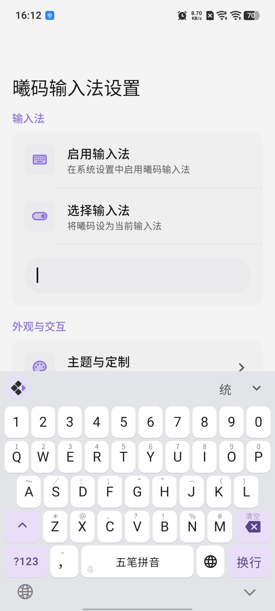
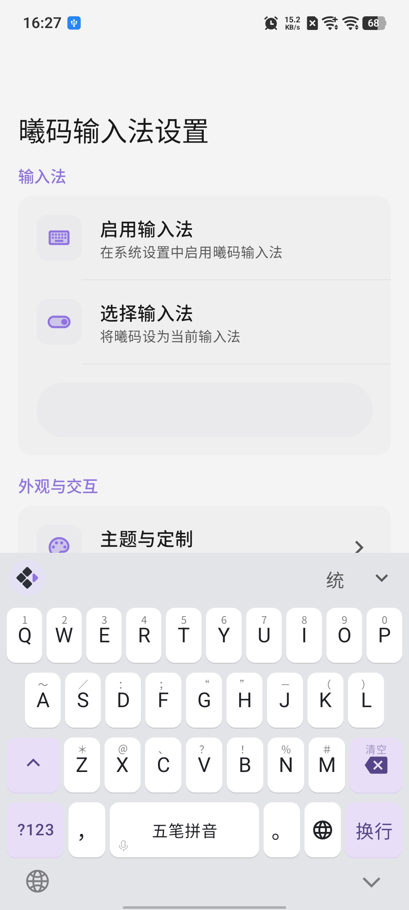

# 全键盘配置教程（新版 · 功能键自定义）

> **注意：本文档对应一次破坏性更新（新 schema）。** 新版不再兼容旧版的写法，旧的配置可能导致部分字段不生效。如果你是从旧版文档过来的，请先看文末的「从旧版迁移」。

> **版本要求**：本文所列字段随新版本提供，旧版本不识别。请以实际发布号为准。

新版全键盘配置的核心思想只有一句话：

> **`layout.rows` 决定「有哪些键、按什么顺序排」，`keys` 决定「每个键做什么」。**

字母键、功能键（`shift` / `delete` / `enter` / `space` / `?123` / 中英切换 / 逗号……）现在一视同仁——它们都是 `keys` 里的一项，都可以配置手势、宽度。

---

## 与旧版的主要区别

| 项目 | 旧版 | 新版 |
|------|------|------|
| 逗号键 id | `'` | `comma` |
| 功能键 | 硬编码，不可配置 | 与字母键一样写在 `keys.<id>`，并在 `layout.rows` 中声明 |
| 键盘行数 | 3 行字母，第 4 行功能键不受 `layout` 控制 | `layout.rows` 全权驱动，支持 4 行标准布局或 5 行（含数字行） |
| 手势槽位 | 4 个（tap / swipe_up / swipe_down / long_press） | 7 个（新增 `double_tap` / `swipe_left` / `swipe_right`） |
| 长按写法 | 数组简写 `long_press: [...]` | 统一为 `long_press: { display?, values: [...] }` |
| `display` | 兼职控制运行时气泡 | `display` 只管**静态提示位置**，`bubble` 独立控制**运行时气泡** |
| 键宽 | 固定 | 任意键可用 `width` 设置（字母默认等宽） |
| 动作复用 | 无 | `keyboard.actions` 预设 + `{ use: 名称 }` 引用 |

---

## 应用你的配置文件

1. 打开 `xime app -> 输入方案 -> 浏览器导入`。
2. 打开你的浏览器，输入手机显示的地址（手机和电脑需在同一网络下）。
3. 上传 `xime.custom.yaml`。
4. 回到 xime app，点击部署。
5. 完成。

> 配置文件位于设备 `rime/` 目录下，需命名为 `xime.custom.yaml`，修改后需 **重新部署** 生效。
>
> **注意**：请勿直接编辑 `xime.yaml`，应用升级时会被覆盖。自定义配置应始终写在 `xime.custom.yaml` 中，系统会自动合并覆盖默认配置。

---

## 配置结构总览

```yaml
metadata:             # 版本信息（可选，自动生成，一般无需手改）
  app_name: Xime
  app_version: ">=2.5.0"
  platform: android
  config_version: 1

xime_index:           # 方案/插件/模型市场索引（可选）
  base_urls: [...]

style:                # 全局样式
  color_scheme: lavender_purple

color_schemes:        # 配色方案定义
  lavender_purple:    # 配色名称（与 style.color_scheme 对应）
    name: "薰衣草紫"
    primary_color: 0x8F73E2

keyboard:             # 键盘配置
  # 可选：动作预设，供下面用 { use: 名称 } 引用
  actions:
    copy_all: { label: "全选", action: select_all }

  colors: {...}       # 键盘颜色（可选）
  key: {...}          # 按键样式（可选）
  shadow: {...}       # 按键阴影（可选）
  fonts: {...}        # 自定义字体（可选）

  qwerty:                     # 中文 26 键键盘
    layout:
      rows:                   # 决定键位：行内可混排字母与功能键
        - [q, w, e, r, t, y, u, i, o, p]
        - [a, s, d, f, g, h, j, k, l]
        - [shift, z, x, c, v, b, n, m, delete]
        - [mode_change, comma, space, earth, enter]
    keys:                     # 决定行为：每个键的手势
      q: { tap: "q", swipe_up: "1" }
      shift: { width: 1.4, tap: { action: command, value: shift_single }, double_tap: { action: command, value: shift_caps } }
      space: { width: 3, tap: { action: space }, long_press: { values: [ { action: voice } ] } }
      # ...
  qwerty_en:                  # 英文 26 键键盘（结构同上）
    layout:
      rows: [...]
    keys: {...}

  # 其他可选键盘：合并键 qwerty_14 / qwerty_17 / qwerty_18、九键 t9 等
```

> 本文以 `keyboard.qwerty` / `keyboard.qwerty_en` 的 `layout` + `keys` 为核心（新版重点），
> 通用配置（`metadata` / `xime_index` / `style` / `color_schemes` / 键盘外观 / 字体 / 九键 / 合并键等）
> 在「[其他配置](#其他配置-与键盘布局无关)」一节，写法与旧版一致。

---

## `layout.rows` — 键位（有哪些键、怎么排）

`rows` 是二维数组，每个元素是「一行按键」，其中每一项是一个键 id：

- 字母键：`q` / `w` / …… / `m`
- 功能键：`shift` / `delete` / `enter` / `space` / `mode_change` / `comma` / `earth`

```yaml
keyboard:
  qwerty:
    layout:
      rows:
        - [q, w, e, r, t, y, u, i, o, p]
        - [a, s, d, f, g, h, j, k, l]
        - [shift, z, x, c, v, b, n, m, delete]
        - [mode_change, comma, space, earth, enter]
```

要点：

- **行列与顺序完全由你决定**：功能键可以出现在任意行、任意位置，也能与字母混排。
- 行内某一段连续字母会按等宽（或各自的 `width`）分配，功能键按其宽度占比分配。
- 只写一行、或漏写功能键，功能键就不会出现——**rows 是键位的唯一来源**。
- 横屏分体键盘复用同一份 `rows`：每行前/后各取一半（奇数时中间键左右各出现一次）。

### 合并键（拼音 14/17/18 键等）

行元素支持嵌套子数组，把多个字母合并到一个键：

```yaml
layout:
  rows:
    - [[q, w], [e, r], [t, y], [u, i], [o, p]]
    - [[a, s], [d, f], [g, h], [j, k], [l]]
    - [[z, x], [c, v], [b, n], [m]]
```

合并键在 `keys` 中的 id 为组内字母拼接（如 `qw`、`er`）。

### 多行与数字行（最多 5 行）

`rows` 最多支持 **5 行**。最常见的是在标准 4 行上方加一行数字：

```yaml
keyboard:
  qwerty:
    layout:
      rows:
        - ["1", "2", "3", "4", "5", "6", "7", "8", "9", "0"]
        - [q, w, e, r, t, y, u, i, o, p]
        - [a, s, d, f, g, h, j, k, l]
        - [shift, z, x, c, v, b, n, m, delete]
        - [mode_change, comma, space, earth, enter]
    keys:
      "1": { tap: "1", long_press: { display: bubble, values: [ "1", "!" ] } }
      "2": { tap: "2", long_press: { display: bubble, values: [ "2", "@" ] } }
      # ..."3" ~ "0" 同理
```

- 少于 4 行时，缺失的行会用内置默认补齐（例如只写 3 行字母，第 4 行补默认控制行）。
- 超过 5 行的部分会被忽略。
- 数字键 id 为 `"1"` ~ `"0"`，是普通按键（不是功能键），点按直接上屏。
- 数字行会让每行略微变矮（键盘总高度不变）。



> 完整示例见仓库 `docs/config_examples/number_row/xime.custom.yaml`（中文与英文各一份）。

### 逗号 / 句号分开

默认把逗号和句号放在同一个键上（句号在逗号的上滑）。若想让两者分开、分列空格左右，把控制行改成：

```yaml
keyboard:
  qwerty:
    layout:
      rows:
        - [q, w, e, r, t, y, u, i, o, p]
        - [a, s, d, f, g, h, j, k, l]
        - [shift, z, x, c, v, b, n, m, delete]
        - [mode_change, comma, space, period, earth, enter]
    keys:
      comma: { width: 0.8, tap: { label: "，", value: "," } }
      period: { width: 0.8, tap: { label: "。", value: "." } }
```

- `comma` 是内置功能键；`period` 不是功能键，作为普通按键使用（在 `keys` 里定义 `tap` 即可）。
- 给两者设置相同的 `width` 可保持对称。



> 完整示例见仓库 `docs/config_examples/comma_period/xime.custom.yaml`（中文与英文各一份）。

---

## `keys` — 行为（每个键做什么）

`keys.<键 id>` 定义该键的手势绑定。**未配置的键使用内置默认行为**。

### 手势槽位

| 槽位 | 说明 |
|------|------|
| `tap` | 点按 |
| `double_tap` | 双击（如 shift 锁定大写） |
| `long_press` | 长按（默认弹气泡滑动选择） |
| `swipe_up` | 上滑 |
| `swipe_down` | 下滑 |
| `swipe_left` | 左滑 |
| `swipe_right` | 右滑 |

> **左右滑与移动光标**：在键盘区域横向滑动默认用于移动光标。若某键配置了 `swipe_left` / `swipe_right`，该键上的横向滑动即由按键接管（执行配置动作），不再移动光标；未配置左右滑的键横向滑动仍用于移动光标。字母键、`delete`、`space`、`shift` 等均可配置左右滑。

> `when_composing`（组合态覆盖）与 `sticky`（键级粘滞）已在解析器中支持，界面接入将在后续版本提供。

### 手势取值格式

**1）字符串简写** —— 按槽位默认动作处理：

```yaml
q: { tap: "q" }          # tap 默认 send_rime（进 rime 组合），与手敲该键一致
a: { swipe_up: "~" }     # swipe/long_press/double_tap 默认 commit（直接上屏）
```

**2）对象格式：**

```yaml
q: { tap: { label: "Q", action: commit, value: "q" } }
```

| 字段 | 类型 | 说明 |
|------|------|------|
| `label` | 字符串 / 数组 | 显示文字；写成数组时按多行显示 |
| `action` | 字符串 | 动作类型（见下方「动作列表」）；写 `null` 表示无动作 |
| `value` | 字符串 | 动作参数（commit 的上屏文本、command 的命令名等） |
| `display` | 字符串 | 静态提示位置：`key` / `bubble` / `both` |
| `bubble` | 布尔 | 运行时是否弹内容气泡（默认 `true`），与 `display` 无关 |
| `repeat` | 布尔 | 是否支持长按重复 |
| `sticky` | 布尔 | 粘滞（预留） |

> `label` 以 `@` 开头表示内置图标，如 `@language`（跟随当前语言显示中/英图标）。

**3）引用预设：**

```yaml
keyboard:
  actions:
    paste_all: { label: "粘贴", action: paste }
  qwerty:
    keys:
      v: { swipe_down: { use: paste_all } }
```

### `long_press` 统一写法

长按只有一种写法：`{ display?, values: [...] }`。`display` 缺省为 `bubble`（弹气泡滑动选择），设 `key` 则直接画在键面上。

```yaml
# 气泡多项（滑动选择）
q: { long_press: { display: bubble, values: [ "q", "Q" ] } }

# 单动作也要写在 values 列表里
space: { long_press: { values: [ { action: voice } ] } }
```

- 对象形式的每一项可带 `label` / `action` / `value`。
- `values` 最多取前 10 项。
- **不再支持数组简写**（旧版 `long_press: ["q","Q"]` 请改为上面的写法）。

### `display` 与 `bubble` 的区别

- `display`：**静态提示**画在哪里。`key` 画在键面、`bubble` 不画键面（留给气泡）、`both` 都画。
- `bubble`：**运行时**滑动/长按时是否弹出内容气泡，默认 `true`。

两者互不影响。想要「键面有提示但不弹气泡」：`display: key, bubble: false`。

---

## 功能键

功能键 id 与内置默认宽度：

| id | 说明 | 默认宽度 |
|----|------|----------|
| `shift` | 大小写 | 1.4 |
| `delete` | 退格 | 1.4 |
| `mode_change` | `?123` 切面板 | 1.2 |
| `enter` | 回车 | 1.2 |
| `space` | 空格 | 3 |
| `comma` | 逗号 | 0.8 |
| `earth` | 中英切换 | 0.8 |

> 字母键默认宽度为 `1`（等宽）。所有这些键都可用 `width` 单独调整。

以下是内置 xime.yaml 中各功能键的默认定义，可直接在 `xime.custom.yaml` 中覆盖：

```yaml
qwerty:
  keys:
    # shift：单击切单击态、双击锁定（命令值走键盘按键路由）
    shift: { width: 1.4, tap: { action: command, value: shift_single }, double_tap: { action: command, value: shift_caps } }

    # delete：单击删除、长按重复删、上滑清空、下滑撤回、左右滑清空输入
    delete: { width: 1.4, tap: { action: delete }, long_press: { values: [ { action: delete, repeat: true } ] }, swipe_up: { action: clear_all, label: "上滑清空" }, swipe_down: { action: undo_clear, label: "下滑撤回" }, swipe_left: { action: command, value: clear_composition }, swipe_right: { action: command, value: clear_composition } }

    # ?123：单击切面板，长按弹出「数字 / 常用符号」
    mode_change: { width: 1.2, tap: { action: command, value: mode_change }, long_press: { display: bubble, values: [ { label: number, action: command, value: mode_change_number }, { label: common_symbol, action: command, value: mode_change_common_symbol } ] } }

    # 空格：单击上屏空格；长按进入语音输入
    space: { width: 3, tap: { action: space }, long_press: { values: [ { action: voice } ] } }

    # 回车
    enter: { width: 1.2, tap: { action: enter } }

    # 逗号
    comma: { tap: { label: "，", value: "," }, swipe_up: { label: "。", value: "." } }

    # 中英切换
    earth: { tap: { label: "@language", action: toggle_ascii } }
```

常见改法：

```yaml
# 空格长按改为「重复空格」（value 为次数，默认 5）
space: { width: 3, tap: { action: space }, long_press: { values: [ { action: repeat_space, value: 5 } ] } }

# shift 上滑清空、下滑撤回
shift: { tap: { action: command, value: shift_single }, swipe_up: { action: clear_all }, swipe_down: { action: undo_clear } }
```

---

## `width` — 键宽

`width` 是列宽比例（数字）。只改变按键宽度占比，不会显示成文字。

```yaml
qwerty:
  keys:
    q: { tap: "q", width: 2 }        # 字母键：q 占两倍宽
    space: { width: 4 }              # 功能键：空格更宽
```

- 字母键默认 `1`（等宽）；功能键有上方表格中的内置默认。
- 不配置 `width` 时不改变任何宽度。
- `width <= 0` 会被忽略（回退默认），避免布局异常。

---

## 动作列表（action）

| 动作 | 说明 |
|------|------|
| `commit` | 上屏文字（`value` 指定内容，缺省用 `label`） |
| `send_rime` | 走键盘按键路由进 rime 组合（字母 `tap` 的默认动作） |
| `command` | 执行命令（`value` 指定命令名，见下） |
| `select_all` / `copy` / `cut` / `paste` | 编辑操作 |
| `line_start` / `line_end` | 光标移到行首 / 行尾 |
| `undo` | 撤销 |
| `none` | 无动作，仅显示 |
| `repeat` | 重复上一次输入 |
| `switch_route` | 打开面板（`value`: `emoji` / `symbol`） |
| `toggle_ascii` | 中 / 英切换 |
| `toggle_symbols` | 切换符号面板 |
| `toggle_shift` | 切换大小写 |
| `delete` | 退格 |
| `enter` | 回车语义 |
| `space` | 空格语义 |
| `clear_all` | 上滑清空（撤回最近一次） |
| `undo_clear` | 下滑撤回 |
| `voice` | 进入语音输入（含麦克风权限校验） |
| `repeat_space` | 重复空格（`value` 为次数，默认 5） |

### `command` 命令名

`action: command` 时，`value` 支持：

| 命令 | 说明 |
|------|------|
| `clear_composition` | 清空当前输入编码和候选词 |
| `show_ime_picker` | 显示系统输入法选择器 |
| `mode_change` | 切换符号 / 数字面板（与 `?123` 同） |
| `mode_change_number` | 切到数字面板 |
| `mode_change_common_symbol` | 切到常用符号面板 |
| `shift_single` | 单击 Shift 语义 |
| `shift_caps` | 双击 Shift 语义（锁定大写） |
| `emoji` / `symbol` | 打开表情 / 符号面板 |

> `command` 的值会走键盘按键路由，因此上面这些与「点击对应按键」完全等价。

---

## 逗号键改名

逗号键的键 id 由旧版的单引号 `'` 改为 `comma`：

```yaml
# 新版
keyboard:
  qwerty:
    keys:
      comma: { tap: { label: "，", value: "," }, swipe_up: { label: "。", value: "." } }
```

---

## 其他配置（与键盘布局无关）

以下配置与新旧键盘 schema 无关，写法与旧版完全一致，可直接沿用。

### `metadata` — 配置元数据

配置文件的基础信息，用于版本兼容性校验和来源追踪。

```yaml
metadata:
  app_name: Xime
  app_version: ">=2.4.2"
  platform: android
  config_version: 1
  generator: "Xime"
  modified_time: "2026-06-18"
```

| 字段 | 类型 | 说明 |
|------|------|------|
| `app_name` | 字符串 | 应用名称，固定为 `Xime` |
| `app_version` | 字符串 | 版本约束（语义化版本范围），如 `">=2.4.2"`。加载时校验当前 APP 版本是否满足，不满足仅警告 |
| `platform` | 字符串 | 目标平台，可选 `android` / `windows` / `linux` |
| `config_version` | 整数 | 配置文件格式版本，当前为 `1` |
| `generator` | 字符串 | 生成配置的工具名称 |
| `modified_time` | 字符串 | 最后修改时间 |

### `xime_index` — 市场索引

```yaml
xime_index:
  base_urls:
    - "https://cdn.jsdelivr.net/gh/ximeiorg/xime-index@master/"
    - "https://fastly.jsdelivr.net/gh/ximeiorg/xime-index@master/"
    - "https://index.ximei.me/"
    - "https://raw.githubusercontent.com/ximeiorg/xime-index/refs/heads/main/"
```

配置方案 / 插件 / 模型市场的下载端点，下载器按顺序依次尝试，直到成功为止。可替换为自建代理或镜像地址。

> 地址末尾需要 `/`。

### `style` — 全局样式

```yaml
style:
  font_size: 14            # 候选词字体大小（单位：sp，手机端无效）
  candidate_count: 5       # 候选栏显示的候选词数量（手机端无效）
  show_code_hint: true     # 是否在候选词右上角显示编码提示（手机端无效）
  horizontal: true         # 候选栏是否水平排列（手机端无效）
  color_scheme: lavender_purple  # 使用的配色方案名称（对应 color_schemes 的键名）
```

| 字段 | 类型 | 默认值 | 说明 |
|------|------|--------|------|
| `font_size` | 整数 | `14` | 候选栏文字字号，单位 sp（仅 PC） |
| `candidate_count` | 整数 | `5` | 候选栏同时显示的候选词数量（仅 PC） |
| `show_code_hint` | 布尔 | `true` | 是否在候选词右上角显示编码（仅 PC） |
| `horizontal` | 布尔 | `true` | `true` 横向滚动候选栏，`false` 纵向排列（仅 PC） |
| `color_scheme` | 字符串 | `"lavender_purple"` | 引用 `color_schemes` 中的配色键名 |

> `font_size`、`candidate_count`、`show_code_hint`、`horizontal` 仅在 PC 端生效，手机端无效。

### `color_schemes` — 配色方案

```yaml
color_schemes:
  lavender_purple:
    name: "薰衣草紫"
    primary_color: 0x8F73E2
  ocean_blue:
    name: "海洋蔚蓝"
    primary_color: 0x1A73E8
  # ... 还可自定义更多
```

| 字段 | 类型 | 说明 |
|------|------|------|
| `键名` | 字符串 | 配色唯一标识，被 `style.color_scheme` 引用 |
| `name` | 字符串 | 配色显示名称，在设置界面中展示 |
| `primary_color` | 十六进制 | 主题色，格式 `0xAARRGGBB`（Alpha 可省略） |
| `keyboard_background` | 对象 | 可选，键盘背景（纯色 / 渐变 / 图片） |
| `key_bg_color` / `key_bg_color_dark` | 十六进制 | 可选，按键背景色及暗色变体 |
| `key_text_color` / `key_text_color_dark` | 十六进制 | 可选，按键文字颜色及暗色变体 |
| `candidate_text_color` / `candidate_text_color_dark` | 十六进制 | 可选，候选文字颜色及暗色变体 |
| `candidate_selected_text_color` / `candidate_selected_text_color_dark` | 十六进制 | 可选，候选选中文字颜色及暗色变体。未设置时回退到 `key_text_color` |

> 各颜色覆盖字段不填时，回退到 `keyboard.colors` 中的全局默认值。

#### `keyboard_background` — 键盘背景

支持三种背景类型（`type`），默认均为纯色。如需渐变 / 图片背景，在对应主题下覆盖 `keyboard_background` 即可。

**纯色（solid）：**

```yaml
keyboard_background:
  type: solid
  color: 0xE3E4E8        # 亮色
  color_dark: 0x1E1838   # 暗色（可选，不填则自动暗化）
```

**渐变（gradient）：**

```yaml
keyboard_background:
  type: gradient
  colors: [0x8F73E2, 0xE8DEF8]        # 亮色渐变断点（至少 2 个）
  colors_dark: [0x4A3F7A, 0x2D2040]   # 暗色渐变断点（可选）
  angle: 90                            # 角度制，0=左→右，90=下→上
```

**图片（image）：**

```yaml
keyboard_background:
  type: image
  src: "themes/bg.png"            # 相对 rime/ 用户目录（优先）或 assets/（回退）
  src_dark: "themes/bg_night.png" # 暗色变体（可选）
  fit: cover                       # cover | contain | fill | fit_width | fit_height | none
  overlay_alpha: 0.35              # 背景遮罩强度（0~1），半透明黑色覆盖层压暗背景
  overlay_alpha_dark: 0.5          # 暗色遮罩强度（可选，不填则沿用 overlay_alpha）
```

| `fit` 值 | 说明 |
|------|------|
| `cover` | 缩放并裁剪以铺满背景（默认） |
| `contain` | 完整显示图片，可能有留白 |
| `fill` | 拉伸铺满，可能变形 |
| `fit_width` | 宽度铺满，高度自适应 |
| `fit_height` | 高度铺满，宽度自适应 |
| `none` | 原始大小 |

自定义图片背景有两种方式：

1. **分享导入**：在相册 / 文件管理把图片「分享到 Xime」，图片自动存入 `rime/themes/custom_<时间戳>.jpg`，并把可用的 `color_schemes` 配置模板复制到剪贴板，粘贴到 `rime/xime.custom.yaml` 后即可在主题设置中选择。
2. **手动放置**：把图片放入 `rime/themes/`，然后在 `xime.custom.yaml` 中添加引用它的 `color_scheme`，`src` 写相对 `rime/` 的路径。内置主题的同名文件会被用户目录中的文件覆盖。

### `keyboard.<section>.schemas` — 键盘布局绑定声明

用于声明「哪些输入方案使用该 keyboard section 的键盘布局」。切换方案时，应用按声明加载对应 section 的布局；**未声明绑定的方案一律使用全键盘（26 键）**。

```yaml
keyboard:
  qwerty_14:
    schemas: [pinyin_14jian]
  t9:
    schemas: [t9_pinyin, t9, wanxiang_t9]
```

内置绑定声明如下（`xime.yaml`）：

| 键盘 section | 内置声明的方案 |
|--------------|----------------|
| `qwerty_14` | `pinyin_14jian` |
| `qwerty_17` | `pinyin_17jian` |
| `qwerty_18` | `pinyin_18jian` |
| `t9` | `t9_pinyin`、`t9`、`wanxiang_t9` |
| `stroke` | `stroke` |
| `handwriting` | `handwriting` |

说明：

- **声明是唯一来源**：应用不再按方案 id（如 `14jian`、`t9`）中的关键字猜测布局，未声明的方案一律全键盘；
- 在 `xime.custom.yaml` 中写 `schemas` 为**追加**语义：在内置声明基础上补充，不会移除内置声明；
- 同一个方案 id 在多个 section 中声明时，以最后出现的为准；
- **接入第三方方案**：九键 / 笔画 / 手写方案，在对应 section 的 `schemas` 中追加方案 id 即可；自定义合并键布局则新增 section（`layout.rows` + `keys` + `schemas`）即可生效，无需等待应用发版。

> **从旧版本升级**：此前版本按方案 id / 名称中的关键字自动识别九键和合并键布局。升级后未声明 `schemas` 的第三方方案将回退为全键盘，需在 `xime.custom.yaml` 中补充声明。

### `keyboard.qwerty.button_layout` — 按键布局模式

用于切换中文键盘按键的内部布局方式，适合不同的显示需求。

```yaml
keyboard:
  qwerty:
    button_layout: compact    # 中文键盘使用紧凑布局
```

| 值 | 说明 |
|------|------|
| `standard` | 默认布局：主文字居中，下滑提示在按键底部显示（默认值） |
| `compact` | 紧凑布局：主文字在左上角，上滑提示在右上角，下滑提示占满按键右侧剩余空间，支持多行显示 |

**示例效果：**

| 五笔字根（standard 布局 + display: bubble） | 小鹤双拼韵母（compact 布局 + display: key） |
|------|------|
|  |  |

`qwerty_en` 也支持同样的配置：

```yaml
keyboard:
  qwerty_en:
    button_layout: compact    # 英文键盘也使用紧凑布局
```

### `keyboard.colors` — 键盘颜色

可选，不设置则使用内置默认值。

```yaml
keyboard:
  colors:
    keyboard_bg_color: 0xE3E4E8           # 键盘背景色（亮色）
    keyboard_bg_color_dark: 0x202020      # 键盘背景色（暗色）
    key_bg_color: 0xFFFFFF                # 按键背景色（亮色）
    key_bg_color_dark: 0x4A4A4A           # 按键背景色（暗色）
    special_key_bg_color: 0x8F73E2        # 特殊按键背景色（亮色，默认取主题色）
    special_key_bg_color_dark: 0x4A4A4A   # 特殊按键背景色（暗色，默认取主题色）
    candidate_bar_bg_color: 0xE3E4E8      # 候选栏背景色（亮色）
    candidate_bar_bg_color_dark: 0x202020 # 候选栏背景色（暗色）
    key_text_color: 0x202124              # 按键文字颜色（亮色）
    key_text_color_dark: 0xE8EAED         # 按键文字颜色（暗色）
    candidate_text_color: 0x202124        # 候选文字颜色（亮色）
    candidate_text_color_dark: 0xE8EAED   # 候选文字颜色（暗色）
```

| 字段 | 类型 | 说明 |
|------|------|------|
| `keyboard_bg_color` / `keyboard_bg_color_dark` | 十六进制 | 键盘背景色（亮色 / 暗色） |
| `key_bg_color` / `key_bg_color_dark` | 十六进制 | 普通按键背景色（亮色 / 暗色） |
| `special_key_bg_color` / `special_key_bg_color_dark` | 十六进制 | 特殊按键背景色（亮色 / 暗色，不设置时默认取主题色） |
| `candidate_bar_bg_color` / `candidate_bar_bg_color_dark` | 十六进制 | 候选栏背景色（亮色 / 暗色） |
| `key_text_color` / `key_text_color_dark` | 十六进制 | 按键文字颜色（亮色 / 暗色） |
| `candidate_text_color` / `candidate_text_color_dark` | 十六进制 | 候选文字颜色（亮色 / 暗色） |

### `keyboard.key` — 按键样式配置

用于配置按键的圆角半径等外观属性。

```yaml
keyboard:
  key:
    corner_radius: 8    # 按键圆角半径（dp，默认 8）
```

| 字段 | 类型 | 默认值 | 说明 |
|------|------|--------|------|
| `corner_radius` | 整数 | `8` | 按键圆角半径，单位 dp |

### `keyboard.shadow` — 按键阴影

```yaml
keyboard:
  shadow:
    enabled: true        # 是否启用阴影
    elevation: 1         # 阴影高度（dp，默认 1）
```

| 字段 | 类型 | 默认值 | 说明 |
|------|------|--------|------|
| `enabled` | 布尔 | `true` | 是否启用按键阴影 |
| `elevation` | 整数 | `1` | 阴影高度，单位 dp |

### `keyboard.fonts` — 自定义字体

用于自定义键盘按键、字根、候选项和注释的字体。字体文件需放在设备 `rime/` 目录（或其子目录）下，可通过浏览器导入上传。

**导入字体文件**：打开 `xime app -> 输入方案 -> 浏览器导入`，上传 `.ttf` / `.otf` / `.woff` / `.woff2` 字体文件，会自动保存到 `rime/fonts/` 目录。

```yaml
keyboard:
  fonts:
    key_font: "fonts/MyFont.ttf"            # 按键主字字体
    key_label_font: "fonts/MyRootFont.ttf"  # 字根/标签字体
    candidate_font: "fonts/MyCandFont.ttf"  # 候选项字体
    comment_font: "fonts/MyCommentFont.ttf" # 候选注释字体
```

| 字段 | 类型 | 默认值 | 说明 |
|------|------|--------|------|
| `key_font` | 字符串 | 空 | 按键主字字体，为空时使用系统默认字体 |
| `key_label_font` | 字符串 | 空 | 字根/标签字体（按键下滑提示、气泡、长按气泡），为空时默认使用内置 ChaiPUA 字体（支持 CJK 扩展区字符） |
| `candidate_font` | 字符串 | 空 | 候选项字体，为空时使用系统默认字体 |
| `comment_font` | 字符串 | 空 | 候选注释（comment/拆分）字体，为空时使用系统默认字体 |

**字体路径查找规则**（均以应用数据根目录为基准）：

| 写法 | 示例 | 实际查找位置 |
|------|------|-------------|
| 绝对路径（以 `/` 开头） | `/fonts/MyFont.ttf` | 应用数据根目录下的 `fonts/` |
| `rime/` 开头 | `rime/fonts/MyFont.ttf` | 应用数据根目录下的 `rime/fonts/` |
| 相对路径（含 `/`） | `fonts/MyFont.ttf` | `rime/fonts/`（浏览器导入的默认位置） |
| 仅文件名 | `MyFont.ttf` | `rime/` 目录（配置文件同目录） |

**使用场景：**

- **键盘显示字根**：形码方案（五笔 / 仓颉等）在按键上或气泡中显示字根时，可通过 `key_label_font` 指定包含这些字形的字体；
- **候选注释显示拆分**：候选词的编码注释 / 拆分提示可通过 `comment_font` 指定专用字体。

> 字体文件不存在或加载失败时，自动回退到默认字体，不影响输入法使用。

### `keyboard.t9` — 九键键盘配置

#### `side_symbols` — 左侧快捷符号栏

自定义九键键盘左侧空闲时显示的快捷符号列表。列表长度不限：不超过 4 个时等分铺满左栏，超过 4 个时可上下滑动。**打字状态下该区域显示拼音候选，不受此配置影响。**

```yaml
keyboard:
  t9:
    side_symbols:
      - "，"
      - "。"
      - "？"
      - "！"
      - "、"
      - "："
      - "；"
      - "…"
```

- 未配置时使用内置默认值（`，。？！`）；
- 在 `xime.custom.yaml` 中写同路径的 `side_symbols` 即可覆盖整个列表；
- 每项为单个符号或字符串，点击即上屏。
- 方案绑定见上文「`keyboard.<section>.schemas` — 键盘布局绑定声明」，内置默认为 `[t9_pinyin, t9, wanxiang_t9]`。

### `keyboard.qwerty_14` / `qwerty_17` / `qwerty_18` — 合并键布局

为拼音 14 键 / 17 键 / 18 键方案提供的专用键盘布局。内置方案通过 `schemas` 声明绑定（见上文「键盘布局绑定声明」），选用对应方案时自动启用对应布局；英文键盘不受影响（切换英文后仍是标准 26 键）。

#### 合并语法

`layout.rows` 的行元素支持嵌套子数组，子数组内的字母合并在同一个键，每行键数变少、按键自然更宽（行内等宽）：

```yaml
layout:
  rows:
    - [[q, w], [e, r], [t, y], [u, i], [o, p]]
    - ...
```

合并键在 `keys` 中的 id 为组内字母拼接（如 `qw`、`er`）：

- `tap`：`label` 显示组内字母，`value` 固定为组内第一个字母（代表字母），Rime 侧由方案的拼写运算靠词库消歧；
- `swipe_up`：前 10 个键按行序输出数字 1-0，其余键沿用 26 键同字母的符号习惯；
- `long_press`：气泡保留组内字母的精确输入作为辅助。

#### 内置默认布局

| section | 对应方案 | 分组 |
|---------|----------|------|
| `qwerty_14` | `pinyin_14jian` | qw/er/ty/ui/op、as/df/gh/jk/l、zx/cv/bn/m |
| `qwerty_17` | `pinyin_17jian` | we/rt/yu/op、sd/fg/jk、xc/bn |
| `qwerty_18` | `pinyin_18jian` | we/rt/io、sd/fg/jk、xc/bn |

> 上表「对应方案」即各 section 内置的 `schemas` 声明。为其他方案启用合并键布局时，在 `xime.custom.yaml` 中声明 `schemas` 即可，无需等待应用发版。
>
> 三个方案的 Rime schema 示例见仓库 [`docs/schemas_examples/`](https://github.com/ximeiorg/Xime/tree/main/docs/schemas_examples) 目录（`pinyin_14jian.schema.yaml` / `pinyin_17jian.schema.yaml` / `pinyin_18jian.schema.yaml`），可作为自制定制方案的参考或直接导入使用。

#### 自定义覆盖

在 `xime.custom.yaml` 中写同名 section 即可覆盖内置默认：

- `layout.rows` 为**整段覆盖**：写了 `rows` 就需要给出完整的行布局，而不是只写要改的一行；
- `keys` 为**按键级覆盖**：只需写要修改的键，未写的键沿用内置默认；注意覆盖是**整键替换**，该键的 `tap` / `swipe_up` / `long_press` 等手势需要在同一条里完整给出；
- `schemas` 为**追加声明**：为自定义方案接入合并键布局时，在其中声明方案 id（如 `schemas: [my_schema]`）。

```yaml
keyboard:
  qwerty_18:
    keys:
      # 示例：把 jk 键的上滑符号由 "-" 改为 "/"（整键替换，手势需写全）
      jk: { tap: { label: "jk", value: "j" }, swipe_up: "/", long_press: { display: "bubble", values: ["j", "k", "J", "K"] } }
```

### 中 / 英切换键

使用键名 `earth`，通过 `toggle_ascii` 动作切换中英文输入模式：

```yaml
# 中文键盘：按键显示"英"，点击切换到英文模式
earth: { tap: { label: "英", action: "toggle_ascii" } }

# 英文键盘：按键显示"中"，点击切换到中文模式
earth: { tap: { label: "中", action: "toggle_ascii" } }
```

#### 动态语言标签

使用 `@language` 作为 `label` 时，按键会自动显示当前语言的名称（中文键盘显示"英"，英文键盘显示"中"），无需手动指定：

```yaml
# 自动显示当前语言的切换按钮
earth: { tap: { label: "@language", action: "toggle_ascii" } }
```

---

## 完整示例

在默认 4 行布局上，定制部分按键：

```yaml
keyboard:
  qwerty:
    layout:
      rows:
        - [q, w, e, r, t, y, u, i, o, p]
        - [a, s, d, f, g, h, j, k, l]
        - [shift, z, x, c, v, b, n, m, delete]
        - [mode_change, comma, space, earth, enter]
    keys:
      # 字母：上滑数字，下滑显示字根（仅显示不上屏）
      q: { tap: "q", swipe_up: "1", swipe_down: { label: "金 钅𠂊勺㐅", action: none, display: bubble } }
      # 字母加宽
      a: { tap: "a", width: 2 }
      # 功能键自定义
      shift: { width: 1.4, tap: { action: command, value: shift_single }, double_tap: { action: command, value: shift_caps } }
      delete: { width: 1.4, tap: { action: delete }, long_press: { values: [ { action: delete, repeat: true } ] }, swipe_up: { action: clear_all }, swipe_down: { action: undo_clear } }
      mode_change: { width: 1.2, tap: { action: command, value: mode_change } }
      space: { width: 3, tap: { action: space }, long_press: { values: [ { action: voice } ] } }
      enter: { width: 1.2, tap: { action: enter } }
      comma: { tap: { label: "，", value: "," }, swipe_up: { label: "。", value: "." } }
      earth: { tap: { label: "@language", action: toggle_ascii } }
```

---

## 从旧版迁移

| 旧版写法 | 新版写法 |
|----------|----------|
| `"'": { ... }`（逗号键） | `comma: { ... }` |
| `long_press: [ "q", "Q" ]` | `long_press: { display: bubble, values: [ "q", "Q" ] }` |
| 3 行 rows（功能键自动补） | 显式写出 4 行，功能键写在 `rows` 与 `keys` 中 |
| 功能键行为硬编码 | 在 `keys.<id>` 覆盖（默认行为见「功能键」） |
| `display` 同时控制气泡 | `display` 只管静态提示；气泡用 `bubble` 控制 |
| 字母宽度不可调 | 字母可用 `width`（默认等宽） |

> 本文已整合旧版中与键盘 schema 无关的通用配置（见「其他配置」），可作为完整教程使用；旧的《全键盘配置教程》保留作历史参考。

---

## 参考示例

应用源码的 [`docs/config_examples/`](https://github.com/ximeiorg/Xime/tree/main/docs/config_examples) 目录按场景提供示例配置，每个子目录内各有一份可直接使用的 `xime.custom.yaml`：

| 示例目录 | 说明 | 重点演示 |
|----------|------|----------|
| [`number_row/`](https://github.com/ximeiorg/Xime/tree/main/docs/config_examples/number_row) | 5 行键盘（顶部数字行） | `layout.rows` 五行布局、数字键 `"1"`~`"0"`、功能键行 |
| [`comma_period/`](https://github.com/ximeiorg/Xime/tree/main/docs/config_examples/comma_period) | 逗号 / 句号分开 | 控制行改为 `comma / space / period`，逗号在空格左、句号在空格右 |
| [`full/`](https://github.com/ximeiorg/Xime/tree/main/docs/config_examples/full) | 完整全键盘配置，适合作为自定义起点 | `style` 全局样式、9 套内置配色、`keyboard.colors` / `key` / `shadow` 样式，中英文键盘全部手势 |
| [`wubi_compact/`](https://github.com/ximeiorg/Xime/tree/main/docs/config_examples/wubi_compact) | 五笔字根 + compact 布局 | `button_layout: compact`，下滑显示五笔字根（`action: none` 仅显示不上屏） |
| [`flypy/`](https://github.com/ximeiorg/Xime/tree/main/docs/config_examples/flypy) | 小鹤双拼方案 | 下滑提示韵母，附带 `keyboard.colors`、`key`、`shadow` 样式配置 |
| [`cangjie/`](https://github.com/ximeiorg/Xime/tree/main/docs/config_examples/cangjie) | 仓颉输入法按键配置 | `tap` 显示仓颉字根、上滑数字、长按带变音符号的相似字母 |
| [`msdouble/`](https://github.com/ximeiorg/Xime/tree/main/docs/config_examples/msdouble) | 微软双拼方案 | `layout.rows` 自定义键盘行布局、`button_layout: compact` |
| [`shortcut/`](https://github.com/ximeiorg/Xime/tree/main/docs/config_examples/shortcut) | 快捷操作按键（最小示例） | 全选 / 剪切 / 复制 / 粘贴 / 段首段尾等编辑动作绑定下滑，仅含 `keyboard` 段 |
| [`theme/`](https://github.com/ximeiorg/Xime/tree/main/docs/config_examples/theme) | 主题配色自定义 | zine 系列 5 套配色，`keyboard_background` 纯色 / 渐变 / 图片背景与 `dark_mode`，仅含 `color_schemes` 段 |

使用方式：在浏览器中打开对应目录下的 `xime.custom.yaml`，点击 `Raw` 下载原始文件后，通过「浏览器导入」上传即可；也可以只复制其中需要的配置段（如 `color_schemes`、`keyboard`）合并到自己的 `xime.custom.yaml` 中。

### 完整全键盘配置

```yaml
metadata:
  app_name: Xime
  app_version: ">=2.4.2"
  platform: android
  config_version: 1
  generator: "Xime"
  modified_time: "2026-06-18"

style:
  color_scheme: lavender_purple

color_schemes:
  lavender_purple:
    name: "薰衣草紫"
    primary_color: 0x8F73E2

keyboard:
  colors:
    keyboard_bg_color: 0xE3E4E8
    keyboard_bg_color_dark: 0x202020
    key_bg_color: 0xFFFFFF
    key_bg_color_dark: 0x4A4A4A
    candidate_bar_bg_color: 0xE3E4E8
    candidate_bar_bg_color_dark: 0x202020
    key_text_color: 0x202124
    key_text_color_dark: 0xE8EAED
    candidate_text_color: 0x202124
    candidate_text_color_dark: 0xE8EAED

  key:
    corner_radius: 8

  shadow:
    enabled: true
    elevation: 1

  qwerty:
    layout:
      rows:
        - [q, w, e, r, t, y, u, i, o, p]
        - [a, s, d, f, g, h, j, k, l]
        - [shift, z, x, c, v, b, n, m, delete]
        - [mode_change, comma, space, earth, enter]
    keys:
      # ── 第一行 ──
      # long_press 顺序：小写 → 大写 → 带变音符号的相似字母
      # swipe_down 显示对应的五笔字根（action:none 仅显示不上屏）
      q: { tap: "q", swipe_up: "1", swipe_down: { label: "金 钅𠂊勺㐅 犭𱼀", action: "none", display: "bubble" }, long_press: { display: "bubble", values: ["q", "Q"] } }
      w: { tap: "w", swipe_up: "2", swipe_down: { label: "人亻八癶", action: "none", display: "bubble" }, long_press: { display: "bubble", values: ["w", "W"] } }
      e: { tap: "e", swipe_up: "3", swipe_down: { label: "月⺼彡乃用爫𧘇豕", action: "none", display: "bubble" }, long_press: { display: "bubble", values: ["e", "E", "è", "é", "ê", "ë"] } }
      r: { tap: "r", swipe_up: "4", swipe_down: { label: "白手龵扌斤𰀪𠂆", action: "none", display: "bubble" }, long_press: { display: "bubble", values: ["r", "R"] } }
      t: { tap: "t", swipe_up: "5", swipe_down: { label: "禾竹丿𠂉彳夂攵", action: "none", display: "bubble" }, long_press: { display: "bubble", values: ["t", "T"] } }
      y: { tap: "y", swipe_up: "6", swipe_down: { label: "言讠文方广亠丶乀", action: "none", display: "bubble" }, long_press: { display: "bubble", values: ["y", "Y", "ÿ"] } }
      u: { tap: "u", swipe_up: "7", swipe_down: { label: "立六辛冫丬门疒丷䒑", action: "none", display: "bubble" }, long_press: { display: "bubble", values: ["u", "U", "ù", "ú", "û", "ü"] } }
      i: { tap: "i", swipe_up: "8", swipe_down: { label: "水氵小氺头𭕄⺌", action: "none", display: "bubble" }, long_press: { display: "bubble", values: ["i", "I", "ì", "í", "î", "ï"] } }
      o: { tap: "o", swipe_up: "9", swipe_down: { label: "火灬米", action: "none", display: "bubble" }, long_press: { display: "bubble", values: ["o", "O", "ò", "ó", "ô", "õ", "ö", "ø"] } }
      p: { tap: "p", swipe_up: "0", swipe_down: { label: "之辶冖宀廴礻", action: "none", display: "bubble" }, long_press: { display: "bubble", values: ["p", "P"] } }

      # ── 第二行 ──
      a: { tap: "a", swipe_up: "~", swipe_down: { label: "工匚戈艹廿龷七弋", action: "none", display: "bubble" }, long_press: { display: "bubble", values: ["a", "A", "à", "á", "â", "ã", "ä", "å", "æ"] } }
      s: { tap: "s", swipe_up: "/", swipe_down: { label: "木丁西", action: "none", display: "bubble" }, long_press: { display: "bubble", values: ["s", "S", "ß"] } }
      d: { tap: "d", swipe_up: "：", swipe_down: { label: "大犬三古龵镸石厂丆", action: "none", display: "bubble" }, long_press: { display: "bubble", values: ["d", "D"] } }
      f: { tap: "f", swipe_up: "；", swipe_down: { label: "土士二干十寸雨", action: "none", display: "bubble" }, long_press: { display: "bubble", values: ["f", "F"] } }
      g: { tap: "g", swipe_up: "“", swipe_down: { label: "王龶五一戋", action: "none", display: "bubble" }, long_press: { display: "bubble", values: ["g", "G"] } }
      h: { tap: "h", swipe_up: "”", swipe_down: { label: "目丨卜⺊上止龰", action: "none", display: "bubble" }, long_press: { display: "bubble", values: ["h", "H"] } }
      j: { tap: "j", swipe_up: "-", swipe_down: { label: "日曰早廾刂虫丿Ⅱ", action: "none", display: "bubble" }, long_press: { display: "bubble", values: ["j", "J"] } }
      k: { tap: "k", swipe_up: "（", swipe_down: { label: "口Ⅲ川", action: "none", display: "bubble" }, long_press: { display: "bubble", values: ["k", "K"] } }
      l: { tap: "l", swipe_up: "）", swipe_down: { label: "田甲囗四罒车皿力", action: "none", display: "bubble" }, long_press: { display: "bubble", values: ["l", "L"] } }

      # ── 第三行 ──
      z: { tap: "z", swipe_up: "*", swipe_down: { label: "", action: "none", display: "key" }, long_press: { display: "bubble", values: ["z", "Z"] } }
      x: { tap: "x", swipe_up: "@", swipe_down: { label: "弓匕纟幺𠤎", action: "none", display: "bubble" }, long_press: { display: "bubble", values: ["x", "X"] } }
      c: { tap: "c", swipe_up: "、", swipe_down: { label: "又巴马厶龴ス", action: "none", display: "bubble" }, long_press: { display: "bubble", values: ["c", "C", "ç"] } }
      v: { tap: "v", swipe_up: "？", swipe_down: { label: "女刀九臼巛彐", action: "none", display: "bubble" }, long_press: { display: "bubble", values: ["v", "V"] } }
      b: { tap: "b", swipe_up: "！", swipe_down: { label: "子耳了也阝卩㔾凵", action: "none", display: "bubble" }, long_press: { display: "bubble", values: ["b", "B"] } }
      n: { tap: "n", swipe_up: "%", swipe_down: { label: "已己巳心忄羽乙𠃜", action: "none", display: "bubble" }, long_press: { display: "bubble", values: ["n", "N", "ñ"] } }
      m: { tap: "m", swipe_up: "#", swipe_down: { label: "山由贝冂冎几", action: "none", display: "bubble" }, long_press: { display: "bubble", values: ["m", "M"] } }
```


### 快捷键方案

将中文键盘第三行按键的下滑手势替换为文本编辑快捷键，并为英文键盘也添加对应的快捷键：

```yaml
style:
  color_scheme: lavender_purple

keyboard:
  colors:
    keyboard_bg_color: 0xE3E4E8
    keyboard_bg_color_dark: 0x202020
    key_bg_color: 0xFFFFFF
    key_bg_color_dark: 0x4A4A4A
    candidate_bar_bg_color: 0xE3E4E8
    candidate_bar_bg_color_dark: 0x202020
    key_text_color: 0x202124
    key_text_color_dark: 0xE8EAED
    candidate_text_color: 0x202124
    candidate_text_color_dark: 0xE8EAED

  key:
    corner_radius: 8

  shadow:
    enabled: true
    elevation: 1

  qwerty:
    keys:
      # ── 第三行（仅列出有修改的按键）──
      z: { tap: "z", swipe_up: "*", swipe_down: { label: "全选", action: "select_all", display: "key" }, long_press: { display: "bubble", values: [ { label: "清空", action: "command", value: "clear_composition" } ] } }
      x: { tap: "x", swipe_up: "@", swipe_down: { label: "剪切", action: "cut", display: "key" }, long_press: { display: "bubble", values: ["x", "X"] } }
      c: { tap: "c", swipe_up: "、", swipe_down: { label: "复制", action: "copy", display: "key" }, long_press: { display: "bubble", values: ["c", "C", "ç"] } }
      v: { tap: "v", swipe_up: "？", swipe_down: { label: "粘贴", action: "paste", display: "key" }, long_press: { display: "bubble", values: ["v", "V"] } }
      n: { tap: "n", swipe_up: "%", swipe_down: { label: "段首", action: "line_start", display: "key" }, long_press: { display: "bubble", values: ["n", "N", "ñ"] } }
      m: { tap: "m", swipe_up: "#", swipe_down: { label: "段尾", action: "line_end", display: "key" }, long_press: { display: "bubble", values: ["m", "M"] } }

  qwerty_en:
    keys:
      # ── 第三行（仅列出有修改的按键）──
      z: { tap: "z", swipe_up: "*", swipe_down: { label: "select all", action: "select_all", display: "key" }, long_press: { display: "bubble", values: [ { label: "clear", action: "command", value: "clear_composition" } ] } }
      x: { tap: "x", swipe_up: "@", swipe_down: { label: "cut", action: "cut", display: "key" }, long_press: { display: "bubble", values: ["x", "X"] } }
      c: { tap: "c", swipe_up: "、", swipe_down: { label: "copy", action: "copy", display: "key" }, long_press: { display: "bubble", values: ["c", "C"] } }
      v: { tap: "v", swipe_up: "?", swipe_down: { label: "paste", action: "paste", display: "key" }, long_press: { display: "bubble", values: ["v", "V"] } }
      n: { tap: "n", swipe_up: "%", swipe_down: { label: "line start", action: "line_start", display: "key" }, long_press: { display: "bubble", values: ["n", "N"] } }
      m: { tap: "m", swipe_up: "#", swipe_down: { label: "line end", action: "line_end", display: "key" }, long_press: { display: "bubble", values: ["m", "M"] } }
      # 逗号键
      comma: { tap: { label: ",", value: "," }, swipe_up: { label: ".", value: "." } }
      # 中 / 英切换键
      earth: { tap: { label: "中", action: "toggle_ascii" } }
```


### 配色主题示例

展示了不同灰度的配色方案（银灰 · 浅、中灰 · 中、烟灰 · 深、墨灰 · 浓），可供参考自定义 `color_schemes`：

```yaml
style:
  color_scheme: zine_medium

color_schemes:
  zine_light:
    name: "银灰 · 浅"
    primary_color: 0x9E9E9E

  zine_medium:
    name: "中灰 · 中"
    primary_color: 0x616161

  zine_dark:
    name: "烟灰 · 深"
    primary_color: 0x424242

  zine_deep:
    name: "墨灰 · 浓"
    primary_color: 0x212121

  zine_photo:
    name: "夜幕之影"     # 图片背景示例，配合 overlay_alpha 压暗
    primary_color: 0x8F73E2
    keyboard_background:
      type: image
      src: "themes/bg.jpg"
      fit: cover
      overlay_alpha: 0.15
      overlay_alpha_dark: 0.30
    key_bg_color: 0x8cffffff
    key_bg_color_dark: 0x5affffff
    key_text_color: 0x232323
    key_text_color_dark: 0xf2f2f2
    candidate_text_color: 0x232323
    candidate_text_color_dark: 0xf2f2f2
```


### 仓颉输入法的显示

将字母按键的点按显示为对应的仓颉字根：

```yaml
keyboard:
  qwerty:
    keys:
      # ── 第一行 ──
      # long_press 顺序：小写 → 大写 → 带变音符号的相似字母
      # tap 显示对应的仓颉字根
      q: { tap: { label: "手", action: "commit", value: "q" }, swipe_up: "1", long_press: { display: "bubble", values: ["q", "Q"] } }
      w: { tap: { label: "田", action: "commit", value: "w" }, swipe_up: "2", long_press: { display: "bubble", values: ["w", "W"] } }
      e: { tap: { label: "水", action: "commit", value: "e" }, swipe_up: "3", long_press: { display: "bubble", values: ["e", "E", "è", "é", "ê", "ë"] } }
      r: { tap: { label: "口", action: "commit", value: "r" }, swipe_up: "4", long_press: { display: "bubble", values: ["r", "R"] } }
      t: { tap: { label: "廿", action: "commit", value: "t" }, swipe_up: "5", long_press: { display: "bubble", values: ["t", "T"] } }
      y: { tap: { label: "重", action: "commit", value: "y" }, swipe_up: "6", long_press: { display: "bubble", values: ["y", "Y", "ÿ"] } }
      u: { tap: { label: "山", action: "commit", value: "u" }, swipe_up: "7", long_press: { display: "bubble", values: ["u", "U", "ù", "ú", "û", "ü"] } }
      i: { tap: { label: "戈", action: "commit", value: "i" }, swipe_up: "8", long_press: { display: "bubble", values: ["i", "I", "ì", "í", "î", "ï"] } }
      o: { tap: { label: "人", action: "commit", value: "o" }, swipe_up: "9", long_press: { display: "bubble", values: ["o", "O", "ò", "ó", "ô", "õ", "ö", "ø"] } }
      p: { tap: { label: "心", action: "commit", value: "p" }, swipe_up: "0", long_press: { display: "bubble", values: ["p", "P"] } }

      # ── 第二行 ──
      a: { tap: { label: "日", action: "commit", value: "a" }, swipe_up: "~", long_press: { display: "bubble", values: ["a", "A", "à", "á", "â", "ã", "ä", "å", "æ"] } }
      s: { tap: { label: "尸", action: "commit", value: "s" }, swipe_up: "/", long_press: { display: "bubble", values: ["s", "S", "ß"] } }
      d: { tap: { label: "木", action: "commit", value: "d" }, swipe_up: "：", long_press: { display: "bubble", values: ["d", "D"] } }
      f: { tap: { label: "火", action: "commit", value: "f" }, swipe_up: "；", long_press: { display: "bubble", values: ["f", "F"] } }
      g: { tap: { label: "土", action: "commit", value: "g" }, swipe_up: "“", long_press: { display: "bubble", values: ["g", "G"] } }
      h: { tap: { label: "竹", action: "commit", value: "h" }, swipe_up: "”", long_press: { display: "bubble", values: ["h", "H"] } }
      j: { tap: { label: "十", action: "commit", value: "j" }, swipe_up: "-", long_press: { display: "bubble", values: ["j", "J"] } }
      k: { tap: { label: "大", action: "commit", value: "k" }, swipe_up: "（", long_press: { display: "bubble", values: ["k", "K"] } }
      l: { tap: { label: "中", action: "commit", value: "l" }, swipe_up: "）", long_press: { display: "bubble", values: ["l", "L"] } }

      # ── 第三行 ──
      z: { tap: { label: "*", action: "commit", value: "z" }, swipe_up: "*", long_press: { display: "bubble", values: ["z", "Z"] } }
      x: { tap: { label: "難", action: "commit", value: "x" }, swipe_up: "@", long_press: { display: "bubble", values: ["x", "X"] } }
      c: { tap: { label: "金", action: "commit", value: "c" }, swipe_up: "、", long_press: { display: "bubble", values: ["c", "C", "ç"] } }
      v: { tap: { label: "女", action: "commit", value: "v" }, swipe_up: "？", long_press: { display: "bubble", values: ["v", "V"] } }
      b: { tap: { label: "月", action: "commit", value: "b" }, swipe_up: "！", long_press: { display: "bubble", values: ["b", "B"] } }
      n: { tap: { label: "弓", action: "commit", value: "n" }, swipe_up: ".", long_press: { display: "bubble", values: ["n", "N", "ñ"] } }
      m: { tap: { label: "一", action: "commit", value: "m" }, swipe_up: "#", long_press: { display: "bubble", values: ["m", "M"] } }

  qwerty_en:
    keys:
      # ── 第一行 ──
      q: { tap: "q", swipe_up: "1", long_press: { display: "bubble", values: ["q", "Q"] } }
      w: { tap: "w", swipe_up: "2", long_press: { display: "bubble", values: ["w", "W"] } }
      e: { tap: "e", swipe_up: "3", long_press: { display: "bubble", values: ["e", "E"] } }
      r: { tap: "r", swipe_up: "4", long_press: { display: "bubble", values: ["r", "R"] } }
      t: { tap: "t", swipe_up: "5", long_press: { display: "bubble", values: ["t", "T"] } }
      y: { tap: "y", swipe_up: "6", long_press: { display: "bubble", values: ["y", "Y"] } }
      u: { tap: "u", swipe_up: "7", long_press: { display: "bubble", values: ["u", "U"] } }
      i: { tap: "i", swipe_up: "8", long_press: { display: "bubble", values: ["i", "I"] } }
      o: { tap: "o", swipe_up: "9", long_press: { display: "bubble", values: ["o", "O"] } }
      p: { tap: "p", swipe_up: "0", long_press: { display: "bubble", values: ["p", "P"] } }
      # ── 第二行 ──
      a: { tap: "a", swipe_up: "~", long_press: { display: "bubble", values: ["a", "A"] } }
      s: { tap: "s", swipe_up: "/", long_press: { display: "bubble", values: ["s", "S"] } }
      d: { tap: "d", swipe_up: ":", long_press: { display: "bubble", values: ["d", "D"] } }
      f: { tap: "f", swipe_up: ";", long_press: { display: "bubble", values: ["f", "F"] } }
      g: { tap: "g", swipe_up: "\"", long_press: { display: "bubble", values: ["g", "G"] } }
      h: { tap: "h", swipe_up: "\"", long_press: { display: "bubble", values: ["h", "H"] } }
      j: { tap: "j", swipe_up: "-", long_press: { display: "bubble", values: ["j", "J"] } }
      k: { tap: "k", swipe_up: "(", long_press: { display: "bubble", values: ["k", "K"] } }
      l: { tap: "l", swipe_up: ")", long_press: { display: "bubble", values: ["l", "L"] } }
      # ── 第三行 ──
      z: { tap: "z", swipe_up: "*", long_press: { display: "bubble", values: ["z", "Z"] } }
      x: { tap: "x", swipe_up: "@", long_press: { display: "bubble", values: ["x", "X"] } }
      c: { tap: "c", swipe_up: "、", long_press: { display: "bubble", values: ["c", "C"] } }
      v: { tap: "v", swipe_up: "?", long_press: { display: "bubble", values: ["v", "V"] } }
      b: { tap: "b", swipe_up: "!", long_press: { display: "bubble", values: ["b", "B"] } }
      n: { tap: "n", swipe_up: "%", long_press: { display: "bubble", values: ["n", "N"] } }
      m: { tap: "m", swipe_up: "#", long_press: { display: "bubble", values: ["m", "M"] } }
      # 逗号键
      comma: { tap: { label: ",", value: "," }, swipe_up: { label: ".", value: "." } }
      # 中 / 英切换键
      earth: { tap: { label: "中", action: "toggle_ascii" } }
```

