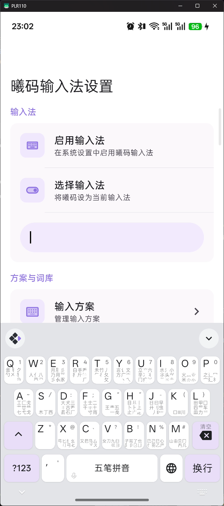
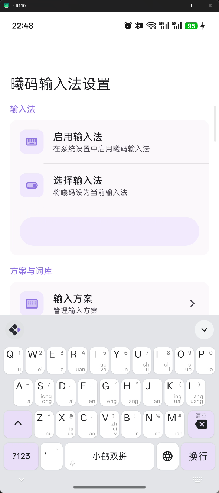

# 全键盘配置教程

**注意: 此功能不做兼容性保证！如果你发现你的配置不生效了，有可能是因为app主做相关的改动，请回来看文档，再做修改！！！**

> **版本要求**：此功能需要 Xime **v2.5.0 及以上版本**（`button_layout` 需要 **v2.5.0-beta10 及以上版本**），旧版本不支持自定义配置文件。

Xime 支持通过 `xime.custom.yaml` 配置文件自定义全键盘的按键布局、手势、配色和样式。以下详细介绍各配置字段的含义。

> 配置文件位于设备 `rime/` 目录下，需命名为 `xime.custom.yaml`，修改后需 **重新部署** 生效。
>
> **注意**：请勿直接编辑 `xime.yaml`，应用升级时会被覆盖。自定义配置应始终写在 `xime.custom.yaml` 中，系统会自动合并覆盖默认配置。

---

## 应用你的配置文件
1. 打开 `xime app -> 输入方案 -> 浏览器导入`。
2. 打开你的浏览器，输入手机显示的地址，需要注意的是，手机和电脑浏览器要在同一个网络下。
3. 把 `xime.custom.yaml` 上传。
4. 回到 xime app,点击部署。
5. 完成


## 配置文件结构总览

```yaml
metadata:             # 版本信息（自动生成，无需手动修改）
  app_name: Xime
  app_version: ">=2.5.0"
  platform: android
  config_version: 1
  generator: "Xime Config Generator"
  modified_time: "2026-06-18"

xime_index:           # 方案/插件/模型市场索引
  base_urls: [...]   # 下载源地址列表

style:                # 全局样式
  color_scheme: lavender_purple

color_schemes:        # 配色方案定义
  lavender_purple:    # 配色名称（与 style.color_scheme 对应）
    name: "薰衣草紫"
    primary_color: 0x8F73E2

keyboard:             # 键盘配置
  colors:             # 键盘颜色（可选）
    keyboard_bg_color: 0xE3E4E8
    # ...
  key:                # 按键样式（可选，v2.5.0+）
    corner_radius: 8
  shadow:             # 按键阴影（可选）
    enabled: true
    elevation: 1
  qwerty:             # 中文键盘按键
    keys:
      q: { tap: "q", swipe_up: "1", swipe_down: {...}, long_press: {...} }
      # ...
  qwerty_en:          # 英文键盘按键
    keys:
      q: { tap: "q", swipe_up: "1", long_press: {...} }
      # ...
```

---

## `metadata` — 配置元数据

配置文件的基础信息，用于版本兼容性校验和来源追踪。

```yaml
metadata:
  app_name: Xime
  app_version: ">=2.4.2"
  platform: android
  config_version: 1
  generator: "Xime"
  modified_time: "2026-06-18"
```

### 字段说明

| 字段 | 类型 | 说明 |
|------|------|------|
| `app_name` | 字符串 | 应用名称，固定为 `Xime` |
| `app_version` | 字符串 | 版本约束（语义化版本范围），如 `">=2.4.2"`。配置文件加载时校验当前 APP 版本是否满足约束，不满足时仅警告不影响加载 |
| `platform` | 字符串 | 目标平台，可选 `android` / `windows` / `linux`。用于跨平台配置管理 |
| `config_version` | 整数 | 配置文件格式版本，递增表示配置结构有破坏性变更。当前为 `1` |
| `generator` | 字符串 | 生成配置的工具名称，如 `"Xime"`、`"Xime Settings Browser Import"` |
| `modified_time` | 字符串 | 最后修改时间 |

---

## `xime_index` — 市场索引

```yaml
xime_index:
  base_urls:
    - "https://cdn.jsdelivr.net/gh/ximeiorg/xime-index@master/"
    - "https://fastly.jsdelivr.net/gh/ximeiorg/xime-index@master/"
    - "https://index.ximei.me/"
    - "https://raw.githubusercontent.com/ximeiorg/xime-index/refs/heads/main/"
```

配置方案/插件/模型市场的下载端点。下载器会按顺序依次尝试，直到成功为止。可替换为自建代理或镜像地址。

> 地址末尾需要 `/`。

---

## `style` — 全局样式

```yaml
style:
  font_size: 14            # 候选词字体大小（单位：sp，手机端无效）
  candidate_count: 5       # 候选栏显示的候选词数量（手机端无效）
  show_code_hint: true     # 是否在候选词右上角显示编码提示（手机端无效）
  horizontal: true         # 候选栏是否水平排列（手机端无效）
  color_scheme: lavender_purple  # 使用的配色方案名称（对应 color_schemes 中的键名）
```

> `font_size`、`candidate_count`、`show_code_hint`、`horizontal` 仅在 PC 端生效，手机端无效。

### 字段说明

| 字段 | 类型 | 默认值 | 说明 |
|------|------|--------|------|
| `font_size` | 整数 | `14` | 候选栏文字的字号，单位 sp（仅 PC） |
| `candidate_count` | 整数 | `5` | 候选栏同时显示的候选词数量（仅 PC） |
| `show_code_hint` | 布尔 | `true` | `true` 时在候选词右上角显示对应的五笔编码（仅 PC） |
| `horizontal` | 布尔 | `true` | `true` 为横向滚动候选栏，`false` 为纵向排列（仅 PC） |
| `color_scheme` | 字符串 | `"lavender_purple"` | 引用 `color_schemes` 中定义的配色键名 |

---

## `color_schemes` — 配色方案

```yaml
color_schemes:
  lavender_purple:
    name: "薰衣草紫"
    primary_color: 0x8F73E2

  ocean_blue:
    name: "海洋蔚蓝"
    primary_color: 0x1A73E8

  forest_green:
    name: "森林翠绿"
    primary_color: 0x2E7D32

  sunset_orange:
    name: "落日橙光"
    primary_color: 0xE65100

  coral_red:
    name: "珊瑚绯红"
    primary_color: 0xC62828

  slate_gray:
    name: "沉稳石墨"
    primary_color: 0x424242

  rose_pink:
    name: "浪漫玫瑰"
    primary_color: 0xAD1457

  teal_cyan:
    name: "青碧如水"
    primary_color: 0x00796B
```

> 以上为内置配色方案，你也可以自定义添加。

### 字段说明

| 字段 | 类型 | 说明 |
|------|------|------|
| `键名` | 字符串 | 配色唯一标识，如 `lavender_purple`，被 `style.color_scheme` 引用 |
| `name` | 字符串 | 配色显示名称，在设置界面中展示 |
| `primary_color` | 十六进制 | 主题色，格式 `0xAARRGGBB`（Alpha + RGB）。如 `0x8F73E2` 为薰衣草紫 |
| `keyboard_background` | 对象 | 可选，键盘背景配置（纯色/渐变/图片），不填则使用全局默认 |
| `key_bg_color` / `key_bg_color_dark` | 十六进制 | 可选，按键背景色及其暗色变体 |
| `key_text_color` / `key_text_color_dark` | 十六进制 | 可选，按键文字颜色及其暗色变体 |
| `candidate_text_color` / `candidate_text_color_dark` | 十六进制 | 可选，候选文字颜色及其暗色变体 |

> `primary_color` 中的 AA 为 Alpha 通道（透明度），可省略（省略时默认为完全不透明）。
> 各颜色覆盖字段不填时，将回退到 `keyboard.colors` 中的全局默认值。

### `keyboard_background` — 键盘背景

`keyboard_background` 支持三种背景类型（`type`），默认均为纯色。如需渐变/图片背景，在对应主题下覆盖 `keyboard_background` 即可。

**纯色（solid）：**

```yaml
keyboard_background:
  type: solid
  color: 0xE3E4E8        # 亮色
  color_dark: 0x1E1838   # 暗色（可选，不填则自动暗化）
```

**渐变（gradient）：**

```yaml
keyboard_background:
  type: gradient
  colors: [0x8F73E2, 0xE8DEF8]        # 亮色渐变断点（至少 2 个）
  colors_dark: [0x4A3F7A, 0x2D2040]   # 暗色渐变断点（可选）
  angle: 90                            # 角度制，0=左→右，90=下→上
```

**图片（image）：**

```yaml
keyboard_background:
  type: image
  src: "themes/bg.png"          # 相对于 rime/ 用户目录（优先）或 assets/（回退）
  src_dark: "themes/bg_night.png" # 暗色变体（可选）
  fit: cover                     # cover | contain | fill | fit_width | fit_height | none
  overlay_alpha: 0.35            # 背景遮罩强度（0~1），半透明黑色覆盖层压暗背景
  overlay_alpha_dark: 0.5        # 暗色模式下的遮罩强度（可选，不填则沿用 overlay_alpha）
```

| `fit` 值 | 说明 |
|------|------|
| `cover` | 缩放并裁剪以铺满背景（默认） |
| `contain` | 完整显示图片，可能有留白 |
| `fill` | 拉伸铺满，可能变形 |
| `fit_width` | 宽度铺满，高度自适应 |
| `fit_height` | 高度铺满，宽度自适应 |
| `none` | 原始大小 |

自定义图片背景有两种方式：

1. **分享导入**：在系统相册/文件管理中把图片「分享到 Xime」，图片自动存入 `rime/themes/custom_<时间戳>.jpg`，并把可用的 `color_schemes` 配置模板复制到剪贴板，粘贴到 `rime/xime.custom.yaml` 后即可在主题设置中选择。
2. **手动放置**：把图片放入 `rime/themes/`（如通过 USB 或文件管理器），然后在 `xime.custom.yaml` 中添加引用它的 `color_scheme`，`src` 写相对 `rime/` 的路径。内置主题的同名文件会被用户目录中的文件覆盖。

---

## `keyboard` — 键盘配置

`keyboard` 包含五个子部分：

| 子项 | 说明 |
|------|------|
| `colors` | 键盘颜色配置（可选） |
| `key` | 按键样式配置（可选，v2.5.0+） |
| `shadow` | 按键阴影配置（可选） |
| `qwerty` | 中文键盘（26 键）按键定义 |
| `qwerty_en` | 英文键盘（26 键）按键定义 |

### `keyboard.qwerty.button_layout` — 按键布局模式（v2.5.0-beta10+）

> **版本要求**：此功能需要 Xime **v2.5.0-beta10 及以上版本**。

用于切换中文键盘按键的内部布局方式，适合不同的显示需求。

```yaml
keyboard:
  qwerty:
    button_layout: compact    # 中文键盘使用紧凑布局
```

| 值 | 说明 |
|------|------|
| `standard` | 默认布局：主文字居中，下滑提示在按键底部显示（默认值） |
| `compact` | 紧凑布局：主文字在左上角，上滑提示在右上角，下滑提示占满按键右侧剩余空间，支持多行显示 |

**示例效果：**

| 五笔字根（standard 布局 + display: bubble） | 小鹤双拼韵母（compact 布局 + display: key） |
|------|------|
|  |  |

`qwerty_en` 也支持同样的配置：

```yaml
keyboard:
  qwerty_en:
    button_layout: compact    # 英文键盘也使用紧凑布局
```

### `keyboard.qwerty.layout.rows` — 键盘行布局自定义（v2.5.2+）

> **版本要求**：此功能需要 Xime **v2.5.2 及以上版本**。

用于自定义键盘每行显示的按键。默认 26 键键盘为 3 行布局（10 + 9 + 7），你可以通过 `layout.rows` 重新排列。

```yaml
keyboard:
  qwerty:
    layout:
      rows:
        - [q, w, e, r, t, y, u, i, o, p]
        - [a, s, d, f, g, h, j, k, l, ";"]
        - [z, x, c, v, b, n, m]
```

#### 字段说明

| 字段 | 类型 | 说明 |
|------|------|------|
| `rows` | 数组 | 二维数组，每行为一个按键名称数组，按键名称为 `keys` 中定义的键名 |

> 注意：`layout.rows` 只控制按键的排列位置和顺序，按键的具体行为（手势）仍需在 `keys` 中定义。目前第四行（空格、功能键等）暂不受 `layout` 控制。

`qwerty_en` 也支持同样的配置：

```yaml
keyboard:
  qwerty_en:
    layout:
      rows:
        - [q, w, e, r, t, y, u, i, o, p]
        - [a, s, d, f, g, h, j, k, l, ";"]
        - [z, x, c, v, b, n, m]
```

### `keyboard.colors` — 键盘颜色

可选，不设置则使用内置默认值。

```yaml
keyboard:
  colors:
    keyboard_bg_color: 0xE3E4E8           # 键盘背景色（亮色）
    keyboard_bg_color_dark: 0x202020      # 键盘背景色（暗色）
    key_bg_color: 0xFFFFFF                # 按键背景色（亮色）
    key_bg_color_dark: 0x4A4A4A           # 按键背景色（暗色）
    special_key_bg_color: 0x8F73E2        # 特殊按键背景色（亮色，不设置时默认取主题色）
    special_key_bg_color_dark: 0x4A4A4A   # 特殊按键背景色（暗色，不设置时默认取主题色）
    candidate_bar_bg_color: 0xE3E4E8      # 候选栏背景色（亮色）
    candidate_bar_bg_color_dark: 0x202020 # 候选栏背景色（暗色）
    key_text_color: 0x202124              # 按键文字颜色（亮色）
    key_text_color_dark: 0xE8EAED         # 按键文字颜色（暗色）
    candidate_text_color: 0x202124        # 候选文字颜色（亮色）
    candidate_text_color_dark: 0xE8EAED   # 候选文字颜色（暗色）
```

#### 字段说明

| 字段 | 类型 | 说明 |
|------|------|------|
| `keyboard_bg_color` | 十六进制 | 键盘背景色（亮色主题） |
| `keyboard_bg_color_dark` | 十六进制 | 键盘背景色（暗色主题） |
| `key_bg_color` | 十六进制 | 普通按键背景色（亮色主题） |
| `key_bg_color_dark` | 十六进制 | 普通按键背景色（暗色主题） |
| `special_key_bg_color` | 十六进制 | 特殊按键（如 Shift）背景色（亮色主题，不设置时默认取主题色） |
| `special_key_bg_color_dark` | 十六进制 | 特殊按键背景色（暗色主题，不设置时默认取主题色） |
| `candidate_bar_bg_color` | 十六进制 | 候选栏背景色（亮色主题） |
| `candidate_bar_bg_color_dark` | 十六进制 | 候选栏背景色（暗色主题） |
| `key_text_color` | 十六进制 | 按键文字颜色（亮色主题） |
| `key_text_color_dark` | 十六进制 | 按键文字颜色（暗色主题） |
| `candidate_text_color` | 十六进制 | 候选文字颜色（亮色主题） |
| `candidate_text_color_dark` | 十六进制 | 候选文字颜色（暗色主题） |

### `keyboard.key` — 按键样式配置（v2.5.0+）

> **版本要求**：此功能需要 Xime **v2.5.0 及以上版本**。

用于配置按键的圆角半径等外观属性。

```yaml
keyboard:
  key:
    corner_radius: 8    # 按键圆角半径（dp，默认 8）
```

#### 字段说明

| 字段 | 类型 | 默认值 | 说明 |
|------|------|--------|------|
| `corner_radius` | 整数 | `8` | 按键圆角半径，单位 dp |

### `keyboard.shadow` — 按键阴影

可选，不设置则使用默认值。

```yaml
keyboard:
  shadow:
    enabled: true        # 是否启用阴影
    elevation: 1         # 阴影高度（dp，默认 1）
```

#### 字段说明

| 字段 | 类型 | 默认值 | 说明 |
|------|------|--------|------|
| `enabled` | 布尔 | `true` | 是否启用按键阴影 |
| `elevation` | 整数 | `1` | 阴影高度，单位 dp |

## `keyboard.keys` — 键盘按键配置

这是全键盘配置的核心部分，每个按键可以定义 4 种手势操作。`qwerty` 对应中文 26 键键盘，`qwerty_en` 对应英文 26 键键盘。

### 手势类型

| 手势 | 字段 | 说明 |
|------|------|------|
| 点按 | `tap` | 单击按键 |
| 上滑 | `swipe_up` | 从按键向上滑动 |
| 下滑 | `swipe_down` | 从按键向下滑动 |
| 长按 | `long_press` | 长按按键，弹出气泡后左右滑动选择 |

### 手势值格式

每个手势的值有三种格式：

#### 1. 字符串简写

直接填写字符串，点击后上屏该文本，按键上显示的也是它。

```yaml
q: { tap: "q" }
```

#### 2. 对象格式（label + action + value）

```yaml
q: { tap: { label: "Q", action: "commit", value: "q" } }
```

| 字段 | 类型 | 必填 | 说明 |
|------|------|------|------|
| `label` | 字符串 | 是 | 按键上显示的文字 |
| `action` | 字符串 | 是 | 动作类型（见下方动作列表） |
| `value` | 字符串 | 否 | 上屏时的输出文本，不指定则用 `label` |
| `display` | 字符串 | 否 | 显示模式，仅 `swipe_down` 和 `long_press` 支持 |

#### 3. 对象格式（label + value，仅用于 swipe_up）

上滑符号可使用独立于 label 的 value，用于在按键上显示中文符号但上屏英文符号：

```yaml
a: { tap: "a", swipe_up: { label: "～", value: "~" } }
```

| 字段 | 类型 | 必填 | 说明 |
|------|------|------|------|
| `label` | 字符串 | 是 | 按键上显示的文字 |
| `value` | 字符串 | 是 | 上屏时的输出文本 |

#### 4. 动作类型（action）

| 动作 | 说明 |
|------|------|
| `commit` | 上屏文字（`value` 指定上屏内容，不指定则用 `label`） |
| `toggle_ascii` | 中/英输入模式切换 |
| `command` | 执行内置命令（`value` 指定命令名） |
| `clipboard` | 打开剪贴板面板，供选择粘贴 |
| `select_all` | 全选当前输入框中的文本 |
| `copy` | 复制选中的文本 |
| `cut` | 剪切选中的文本 |
| `paste` | 粘贴剪贴板内容 |
| `line_start` | 光标移动到行首 |
| `line_end` | 光标移动到行尾 |
| `undo` | 撤销上一步操作 |
| `none` | 无动作，仅用于显示（如显示五笔字根） |
| `repeat` | 重复上一次输入 |

#### 5. 内置命令（command）

当 `action` 为 `command` 时，`value` 支持以下命令：

| 命令 | 说明 |
|------|------|
| `clear_composition` | 清空当前输入编码和候选词 |
| `show_ime_picker` | 显示系统输入法选择器（切换输入法） |

#### 6. 显示模式（display）

仅 `swipe_down` 和 `long_press` 支持：

| 模式 | 值 | 说明 |
|------|------|------|
| 气泡显示 | `"bubble"` | 下滑或长按时以气泡弹出显示内容，不占用按键空间 |
| 按键显示 | `"key"` | 直接在按键上显示文字（配合 `compact` 布局时显示在按键右下方，支持多行） |

---

### 长按配置（long_press）

长按支持弹出多个选项供用户滑动选择。使用 `display: "bubble"` 配合 `values` 数组：

```yaml
# 对象格式 — 可指定 label、action、value
long_press:
  display: "bubble"
  values:
    - { label: "大写", action: "commit", value: "A" }
    - { label: "Ä",   action: "commit", value: "ä" }

# 字符串简写 — 直接上屏
long_press:
  display: "bubble"
  values: ["q", "Q"]
```

---

### 下滑配置（swipe_down）

下滑通常用于显示五笔字根（`action: none` 仅显示不上屏），或快捷操作（如粘贴、全选等）。

#### 字根显示（气泡模式）

```yaml
swipe_down:
  label: "金 钅𠂊勺㐅 犭𱼀"   # 字根文字
  action: "none"                # 仅显示，不上屏
  display: "bubble"             # 气泡显示
```

#### 快捷操作（按键模式）

```yaml
swipe_down:
  label: "粘贴"      # 按键上显示的文字
  action: "paste"    # 粘贴动作
  display: "key"     # 直接显示在按键上
```

---

### 逗号键

逗号键使用单引号 `'` 作为键名：

```yaml
"'": { tap: { label: "，", value: "," }, swipe_up: { label: "。", value: "." } }
```

`label` 为按键上显示的中文符号，`value` 为上屏时的实际符号。

### 中/英切换键

使用键名 `earth`，通过 `toggle_ascii` 动作切换中英文输入模式：

```yaml
# 中文键盘：按键显示"英"，点击切换到英文模式
earth: { tap: { label: "英", action: "toggle_ascii" } }

# 英文键盘：按键显示"中"，点击切换到中文模式
earth: { tap: { label: "中", action: "toggle_ascii" } }
```

#### 动态语言标签

使用 `@language` 作为 `label` 时，按键会自动显示当前语言的名称（中文键盘显示"英"，英文键盘显示"中"），无需手动指定：

```yaml
# 自动显示当前语言的切换按钮
earth: { tap: { label: "@language", action: "toggle_ascii" } }
```

---

## 参考示例

应用源码的 [`docs/config_examples/`](https://github.com/kingzcheung/Xime/tree/main/docs/config_examples) 目录下提供了多种场景的独立示例 YAML 文件，可直接下载使用或作为自定义配置的参考：

| 文件 | 说明 |
|------|------|
| [`xime.full_example.yaml`](https://github.com/kingzcheung/Xime/blob/main/docs/config_examples/xime.full_example.yaml) | 完整全键盘配置（含所有手势、配色、阴影） |
| [`xime.wubi_compact.yaml`](https://github.com/kingzcheung/Xime/blob/main/docs/config_examples/xime.wubi_compact.yaml) | 五笔字根 + compact 布局示例 |
| [`xime.flypy.yaml`](https://github.com/kingzcheung/Xime/blob/main/docs/config_examples/xime.flypy.yaml) | 小鹤双拼韵母提示示例 |
| [`xime.cangjie.yaml`](https://github.com/kingzcheung/Xime/blob/main/docs/config_examples/xime.cangjie.yaml) | 仓颉输入法按键配置示例 |
| [`xime.shortcut.yaml`](https://github.com/kingzcheung/Xime/blob/main/docs/config_examples/xime.shortcut.yaml) | 快捷操作按键配置示例 |
| [`xime.ms.double.yaml`](https://github.com/kingzcheung/Xime/blob/main/docs/config_examples/xime.ms.double.yaml) | 微软双拼方案配置示例（含 `layout.rows` 自定义键盘行布局） |
| [`xime.theme_example.yaml`](https://github.com/kingzcheung/Xime/blob/main/docs/config_examples/xime.theme_example.yaml) | 主题配色自定义示例 |

你可以在浏览器中打开这些文件，将内容复制到 `xime.custom.yaml` 中，或直接点击 `Raw` 按钮下载原始文件后通过"浏览器导入"上传。

---

### 完整全键盘配置

```yaml
metadata:
  app_name: Xime
  app_version: ">=2.4.2"
  platform: android
  config_version: 1
  generator: "Xime"
  modified_time: "2026-06-18"

xime_index:
  # 方案/插件/模型市场索引端点（ximeiorg/xime-index）。
  # 可替换为自建代理/镜像，下载器按顺序依次尝试，直到成功为止。
  # 末尾需要 /。
  base_urls:
    - "https://cdn.jsdelivr.net/gh/ximeiorg/xime-index/"
    - "https://fastly.jsdelivr.net/gh/ximeiorg/xime-index/"
    - "https://index.ximei.me/"
    - "https://raw.githubusercontent.com/ximeiorg/xime-index/refs/heads/main/"

style:
  color_scheme: lavender_purple

color_schemes:
  lavender_purple:
    name: "薰衣草紫"
    primary_color: 0x8F73E2

  ocean_blue:
    name: "海洋蔚蓝"
    primary_color: 0x1A73E8

  forest_green:
    name: "森林翠绿"
    primary_color: 0x2E7D32

  sunset_orange:
    name: "落日橙光"
    primary_color: 0xE65100

  coral_red:
    name: "珊瑚绯红"
    primary_color: 0xC62828

  slate_gray:
    name: "沉稳石墨"
    primary_color: 0x424242

  rose_pink:
    name: "浪漫玫瑰"
    primary_color: 0xAD1457

  teal_cyan:
    name: "青碧如水"
    primary_color: 0x00796B

## `keyboard.qwerty` / `keyboard.qwerty_en` — 键盘按键配置
  colors:
    keyboard_bg_color: 0xE3E4E8
    keyboard_bg_color_dark: 0x202020
    key_bg_color: 0xFFFFFF
    key_bg_color_dark: 0x4A4A4A
    candidate_bar_bg_color: 0xE3E4E8
    candidate_bar_bg_color_dark: 0x202020
    key_text_color: 0x202124
    key_text_color_dark: 0xE8EAED
    candidate_text_color: 0x202124
    candidate_text_color_dark: 0xE8EAED

  key:
    corner_radius: 8

  shadow:
    enabled: true
    elevation: 1

  keys:
    # ── 第一行 ──
    # long_press 顺序：小写 → 大写 → 带变音符号的相似字母
    # swipe_down 显示对应的五笔字根（action:none 仅显示不上屏）
    # display: bubble → 气泡显示；key → 显示在按键上（最多显示 2 个字）
    q: { tap: "q", swipe_up: "1", swipe_down: { label: "金 钅𠂊勺㐅 犭𱼀", action: "none", display: "bubble" }, long_press: { display: "bubble", values: ["q", "Q"] } }
    w: { tap: "w", swipe_up: "2", swipe_down: { label: "人亻八癶", action: "none", display: "bubble" }, long_press: { display: "bubble", values: ["w", "W"] } }
    e: { tap: "e", swipe_up: "3", swipe_down: { label: "月⺼彡乃用爫彡𧘇豕", action: "none", display: "bubble" }, long_press: { display: "bubble", values: ["e", "E", "è", "é", "ê", "ë"] } }
    r: { tap: "r", swipe_up: "4", swipe_down: { label: "白手龵扌斤𰀪𠂆", action: "none", display: "bubble" }, long_press: { display: "bubble", values: ["r", "R"] } }
    t: { tap: "t", swipe_up: "5", swipe_down: { label: "禾竹丿𠂉彳夂攵", action: "none", display: "bubble" }, long_press: { display: "bubble", values: ["t", "T"] } }
    y: { tap: "y", swipe_up: "6", swipe_down: { label: "言讠文方广亠丶乀", action: "none", display: "bubble" }, long_press: { display: "bubble", values: ["y", "Y", "ÿ"] } }
    u: { tap: "u", swipe_up: "7", swipe_down: { label: "立六辛冫丬门疒丷䒑", action: "none", display: "bubble" }, long_press: { display: "bubble", values: ["u", "U", "ù", "ú", "û", "ü"] } }
    i: { tap: "i", swipe_up: "8", swipe_down: { label: "水氵小氺头𭕄⺌", action: "none", display: "bubble" }, long_press: { display: "bubble", values: ["i", "I", "ì", "í", "î", "ï"] } }
    o: { tap: "o", swipe_up: "9", swipe_down: { label: "火灬米", action: "none", display: "bubble" }, long_press: { display: "bubble", values: ["o", "O", "ò", "ó", "ô", "õ", "ö", "ø"] } }
    p: { tap: "p", swipe_up: "0", swipe_down: { label: "之辶冖宀廴礻", action: "none", display: "bubble" }, long_press: { display: "bubble", values: ["p", "P"] } }

    # ── 第二行 ──
    a: { tap: "a", swipe_up: "~", swipe_down: { label: "工匚戈艹廿龷七弋戈", action: "none", display: "bubble" }, long_press: { display: "bubble", values: ["a", "A", "à", "á", "â", "ã", "ä", "å", "æ"] } }
    s: { tap: "s", swipe_up: "/", swipe_down: { label: "木丁西", action: "none", display: "bubble" }, long_press: { display: "bubble", values: ["s", "S", "ß"] } }
    d: { tap: "d", swipe_up: "：", swipe_down: { label: "大犬三古龵镸石厂丆", action: "none", display: "bubble" }, long_press: { display: "bubble", values: ["d", "D"] } }
    f: { tap: "f", swipe_up: "；", swipe_down: { label: "土士二干十寸雨", action: "none", display: "bubble" }, long_press: { display: "bubble", values: ["f", "F"] } }
    g: { tap: "g", swipe_up: "“", swipe_down: { label: "王龶五一戋", action: "none", display: "bubble" }, long_press: { display: "bubble", values: ["g", "G"] } }
    h: { tap: "h", swipe_up: "”", swipe_down: { label: "目丨卜⺊上止龰", action: "none", display: "bubble" }, long_press: { display: "bubble", values: ["h", "H"] } }
    j: { tap: "j", swipe_up: "-", swipe_down: { label: "日曰早廾刂虫丿Ⅱ", action: "none", display: "bubble" }, long_press: { display: "bubble", values: ["j", "J"] } }
    k: { tap: "k", swipe_up: "（", swipe_down: { label: "口Ⅲ川", action: "none", display: "bubble" }, long_press: { display: "bubble", values: ["k", "K"] } }
    l: { tap: "l", swipe_up: "）", swipe_down: { label: "田甲囗四罒车皿力", action: "none", display: "bubble" }, long_press: { display: "bubble", values: ["l", "L"] } }

    # ── 第三行 ──
    z: { tap: "z", swipe_up: "*", swipe_down: { label: "", action: "none", display: "key" }, long_press: { display: "bubble", values: [ "z","Z"] } }
    x: { tap: "x", swipe_up: "@", swipe_down: { label: "弓匕纟幺弓𠤎", action: "none", display: "bubble" }, long_press: { display: "bubble", values: ["x", "X"] } }
    c: { tap: "c", swipe_up: "、", swipe_down: { label: "又巴马厶龴ス", action: "none", display: "bubble" }, long_press: { display: "bubble", values: ["c", "C", "ç"] } }
    v: { tap: "v", swipe_up: "？", swipe_down: { label: "女刀九臼巛彐", action: "none", display: "bubble" }, long_press: { display: "bubble", values: ["v", "V"] } }
    b: { tap: "b", swipe_up: "！", swipe_down: { label: "子耳了也阝卩㔾凵", action: "none", display: "bubble" }, long_press: { display: "bubble", values: ["b", "B"] } }
    n: { tap: "n", swipe_up: "%", swipe_down: { label: "已己巳心忄羽乙𠃜", action: "none", display: "bubble" }, long_press: { display: "bubble", values: ["n", "N", "ñ"] } }
    m: { tap: "m", swipe_up: "#", swipe_down: { label: "山由贝冂冎几", action: "none", display: "bubble" }, long_press: { display: "bubble", values: ["m", "M"] } }
```


### 快捷键方案

将中文键盘第三行按键的下滑手势替换为文本编辑快捷键，并为英文键盘也添加对应的快捷键：

```yaml
style:
  color_scheme: lavender_purple

keyboard:
  colors:
    keyboard_bg_color: 0xE3E4E8
    keyboard_bg_color_dark: 0x202020
    key_bg_color: 0xFFFFFF
    key_bg_color_dark: 0x4A4A4A
    candidate_bar_bg_color: 0xE3E4E8
    candidate_bar_bg_color_dark: 0x202020
    key_text_color: 0x202124
    key_text_color_dark: 0xE8EAED
    candidate_text_color: 0x202124
    candidate_text_color_dark: 0xE8EAED
  
  key:
    corner_radius: 8

  shadow:
    enabled: true
    elevation: 1
  
  qwerty:
    keys:
      # ── 第三行（仅列出有修改的按键）──
      z: { tap: "z", swipe_up: "*", swipe_down: { label: "全选", action: "select_all", display: "key" }, long_press: { display: "bubble", values: [ { label: "清空", action: "command", value: "clear_composition" } ] } }
      x: { tap: "x", swipe_up: "@", swipe_down: { label: "剪切", action: "cut", display: "key" }, long_press: { display: "bubble", values: ["x", "X"] } }
      c: { tap: "c", swipe_up: "、", swipe_down: { label: "复制", action: "copy", display: "key" }, long_press: { display: "bubble", values: ["c", "C", "ç"] } }
      v: { tap: "v", swipe_up: "？", swipe_down: { label: "粘贴", action: "paste", display: "key" }, long_press: { display: "bubble", values: ["v", "V"] } }
      b: { tap: "b", swipe_up: "！", swipe_down: { label: "", action: "none", display: "key" }, long_press: { display: "bubble", values: ["b", "B"] } }
      n: { tap: "n", swipe_up: "%", swipe_down: { label: "段首", action: "line_start", display: "key" }, long_press: { display: "bubble", values: ["n", "N", "ñ"] } }
      m: { tap: "m", swipe_up: "#", swipe_down: { label: "段尾", action: "line_end", display: "key" }, long_press: { display: "bubble", values: ["m", "M"] } }
  
  qwerty_en:
    keys:
      # ── 第三行（仅列出有修改的按键）──
      z: { tap: "z", swipe_up: "*", swipe_down: { label: "全选", action: "select_all", display: "key" }, long_press: { display: "bubble", values: [ { label: "clear", action: "command", value: "clear_composition" } ] } }
      x: { tap: "x", swipe_up: "@", swipe_down: { label: "cut", action: "cut", display: "key" }, long_press: { display: "bubble", values: ["x", "X"] } }
      c: { tap: "c", swipe_up: "、", swipe_down: { label: "copy", action: "copy", display: "key" }, long_press: { display: "bubble", values: ["c", "C"] } }
      v: { tap: "v", swipe_up: "?", swipe_down: { label: "paste", action: "paste", display: "key" }, long_press: { display: "bubble", values: ["v", "V"] } }
      b: { tap: "b", swipe_up: "!", swipe_down: { label: "", action: "none", display: "key" }, long_press: { display: "bubble", values: ["b", "B"] } }
      n: { tap: "n", swipe_up: "%", swipe_down: { label: "line start", action: "line_start", display: "key" }, long_press: { display: "bubble", values: ["n", "N"] } }
      m: { tap: "m", swipe_up: "#", swipe_down: { label: "line end", action: "line_end", display: "key" }, long_press: { display: "bubble", values: ["m", "M"] } }
      # 逗号键
      "'": { tap: { label: ",", value: "," }, swipe_up: { label: ".", value: "." } }
      # 中/英切换键
      earth: { tap: { label: "中", action: "toggle_ascii" } }
```


### 配色主题示例

展示了不同灰度的配色方案（银灰 · 浅、中灰 · 中、烟灰 · 深、墨灰 · 浓），可供参考自定义 `color_schemes`：

```yaml
style:
  color_scheme: zine_medium

color_schemes:
  zine_light:
    name: "银灰 · 浅"
    primary_color: 0x9E9E9E

  zine_medium:
    name: "中灰 · 中"
    primary_color: 0x616161

  zine_dark:
    name: "烟灰 · 深"
    primary_color: 0x424242

  zine_deep:
    name: "墨灰 · 浓"
    primary_color: 0x212121

  zine_photo:
    name: "夜幕之影"     # 图片背景示例，配合 overlay_alpha 压暗
    primary_color: 0x8F73E2
    keyboard_background:
      type: image
      src: "themes/bg.jpg"
      fit: cover
      overlay_alpha: 0.15
      overlay_alpha_dark: 0.30
    key_bg_color: 0x8cffffff
    key_bg_color_dark: 0x5affffff
    key_text_color: 0x232323
    key_text_color_dark: 0xf2f2f2
    candidate_text_color: 0x232323
    candidate_text_color_dark: 0xf2f2f2
```


### 仓颉输入法的显示

将字母按键的点按显示为对应的仓颉字根：

```yaml
keyboard:
  qwerty:
    keys:
      # ── 第一行 ──
      # long_press 顺序：小写 → 大写 → 带变音符号的相似字母
      # tap 显示对应的仓颉字根
      q: { tap: { label: "手", action: "commit", value: "q" }, swipe_up: "1", long_press: { display: "bubble", values: ["q", "Q"] } }
      w: { tap: { label: "田", action: "commit", value: "w" }, swipe_up: "2", long_press: { display: "bubble", values: ["w", "W"] } }
      e: { tap: { label: "水", action: "commit", value: "e" }, swipe_up: "3", long_press: { display: "bubble", values: ["e", "E", "è", "é", "ê", "ë"] } }
      r: { tap: { label: "口", action: "commit", value: "r" }, swipe_up: "4", long_press: { display: "bubble", values: ["r", "R"] } }
      t: { tap: { label: "廿", action: "commit", value: "t" }, swipe_up: "5", long_press: { display: "bubble", values: ["t", "T"] } }
      y: { tap: { label: "重", action: "commit", value: "y" }, swipe_up: "6", long_press: { display: "bubble", values: ["y", "Y", "ÿ"] } }
      u: { tap: { label: "山", action: "commit", value: "u" }, swipe_up: "7", long_press: { display: "bubble", values: ["u", "U", "ù", "ú", "û", "ü"] } }
      i: { tap: { label: "戈", action: "commit", value: "i" }, swipe_up: "8", long_press: { display: "bubble", values: ["i", "I", "ì", "í", "î", "ï"] } }
      o: { tap: { label: "人", action: "commit", value: "o" }, swipe_up: "9", long_press: { display: "bubble", values: ["o", "O", "ò", "ó", "ô", "õ", "ö", "ø"] } }
      p: { tap: { label: "心", action: "commit", value: "p" }, swipe_up: "0", long_press: { display: "bubble", values: ["p", "P"] } }

      # ── 第二行 ──
      a: { tap: { label: "日", action: "commit", value: "a" }, swipe_up: "~", long_press: { display: "bubble", values: ["a", "A", "à", "á", "â", "ã", "ä", "å", "æ"] } }
      s: { tap: { label: "尸", action: "commit", value: "s" }, swipe_up: "/", long_press: { display: "bubble", values: ["s", "S", "ß"] } }
      d: { tap: { label: "木", action: "commit", value: "d" }, swipe_up: "：", long_press: { display: "bubble", values: ["d", "D"] } }
      f: { tap: { label: "火", action: "commit", value: "f" }, swipe_up: "；", long_press: { display: "bubble", values: ["f", "F"] } }
      g: { tap: { label: "土", action: "commit", value: "g" }, swipe_up: "“", long_press: { display: "bubble", values: ["g", "G"] } }
      h: { tap: { label: "竹", action: "commit", value: "h" }, swipe_up: "”", long_press: { display: "bubble", values: ["h", "H"] } }
      j: { tap: { label: "十", action: "commit", value: "j" }, swipe_up: "-", long_press: { display: "bubble", values: ["j", "J"] } }
      k: { tap: { label: "大", action: "commit", value: "k" }, swipe_up: "（", long_press: { display: "bubble", values: ["k", "K"] } }
      l: { tap: { label: "中", action: "commit", value: "l" }, swipe_up: "）", long_press: { display: "bubble", values: ["l", "L"] } }

      # ── 第三行 ──
      z: { tap: { label: "*", action: "commit", value: "z" }, swipe_up: "*", long_press: { display: "bubble", values: ["z", "Z"] } }
      x: { tap: { label: "難", action: "commit", value: "x" }, swipe_up: "@", long_press: { display: "bubble", values: ["x", "X"] } }
      c: { tap: { label: "金", action: "commit", value: "c" }, swipe_up: "、", long_press: { display: "bubble", values: ["c", "C", "ç"] } }
      v: { tap: { label: "女", action: "commit", value: "v" }, swipe_up: "？", long_press: { display: "bubble", values: ["v", "V"] } }
      b: { tap: { label: "月", action: "commit", value: "b" }, swipe_up: "！", long_press: { display: "bubble", values: ["b", "B"] } }
      n: { tap: { label: "弓", action: "commit", value: "n" }, swipe_up: ".", long_press: { display: "bubble", values: ["n", "N", "ñ"] } }
      m: { tap: { label: "一", action: "commit", value: "m" }, swipe_up: "#", long_press: { display: "bubble", values: ["m", "M"] } }

  qwerty_en:
    keys:
      # ── 第一行 ──
      q: { tap: "q", swipe_up: "1", long_press: { display: "bubble", values: ["q", "Q"] } }
      w: { tap: "w", swipe_up: "2", long_press: { display: "bubble", values: ["w", "W"] } }
      e: { tap: "e", swipe_up: "3", long_press: { display: "bubble", values: ["e", "E"] } }
      r: { tap: "r", swipe_up: "4", long_press: { display: "bubble", values: ["r", "R"] } }
      t: { tap: "t", swipe_up: "5", long_press: { display: "bubble", values: ["t", "T"] } }
      y: { tap: "y", swipe_up: "6", long_press: { display: "bubble", values: ["y", "Y"] } }
      u: { tap: "u", swipe_up: "7", long_press: { display: "bubble", values: ["u", "U"] } }
      i: { tap: "i", swipe_up: "8", long_press: { display: "bubble", values: ["i", "I"] } }
      o: { tap: "o", swipe_up: "9", long_press: { display: "bubble", values: ["o", "O"] } }
      p: { tap: "p", swipe_up: "0", long_press: { display: "bubble", values: ["p", "P"] } }
      # ── 第二行 ──
      a: { tap: "a", swipe_up: "~", long_press: { display: "bubble", values: ["a", "A"] } }
      s: { tap: "s", swipe_up: "/", long_press: { display: "bubble", values: ["s", "S"] } }
      d: { tap: "d", swipe_up: ":", long_press: { display: "bubble", values: ["d", "D"] } }
      f: { tap: "f", swipe_up: ";", long_press: { display: "bubble", values: ["f", "F"] } }
      g: { tap: "g", swipe_up: "\"", long_press: { display: "bubble", values: ["g", "G"] } }
      h: { tap: "h", swipe_up: "\"", long_press: { display: "bubble", values: ["h", "H"] } }
      j: { tap: "j", swipe_up: "-", long_press: { display: "bubble", values: ["j", "J"] } }
      k: { tap: "k", swipe_up: "(", long_press: { display: "bubble", values: ["k", "K"] } }
      l: { tap: "l", swipe_up: ")", long_press: { display: "bubble", values: ["l", "L"] } }
      # ── 第三行 ──
      z: { tap: "z", swipe_up: "*", long_press: { display: "bubble", values: ["z", "Z"] } }
      x: { tap: "x", swipe_up: "@", long_press: { display: "bubble", values: ["x", "X"] } }
      c: { tap: "c", swipe_up: "、", long_press: { display: "bubble", values: ["c", "C"] } }
      v: { tap: "v", swipe_up: "?", long_press: { display: "bubble", values: ["v", "V"] } }
      b: { tap: "b", swipe_up: "!", long_press: { display: "bubble", values: ["b", "B"] } }
      n: { tap: "n", swipe_up: "%", long_press: { display: "bubble", values: ["n", "N"] } }
      m: { tap: "m", swipe_up: "#", long_press: { display: "bubble", values: ["m", "M"] } }
      # 逗号键
      "'": { tap: { label: ",", value: "," }, swipe_up: { label: ".", value: "." } }
      # 中/英切换键
      earth: { tap: { label: "中", action: "toggle_ascii" } }
```


