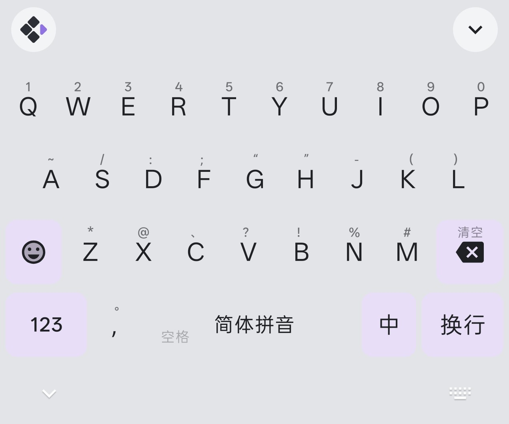
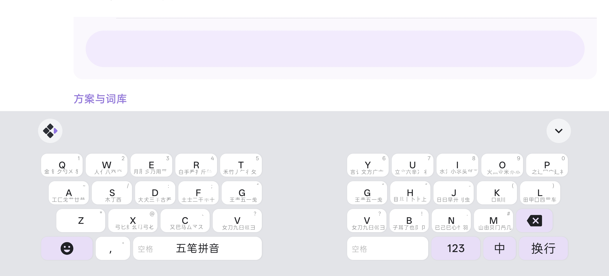
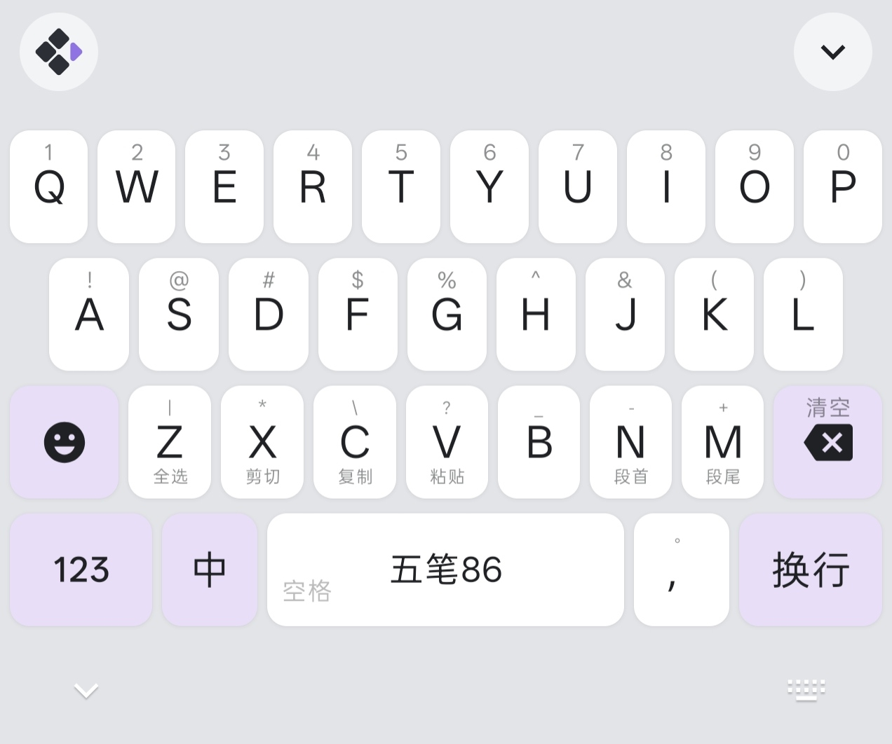
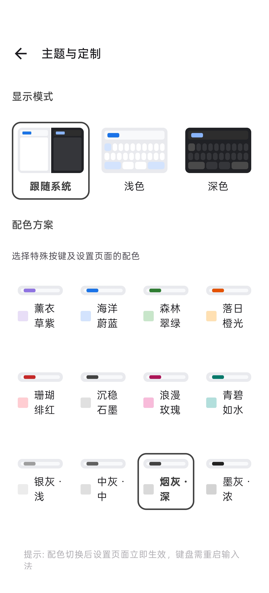
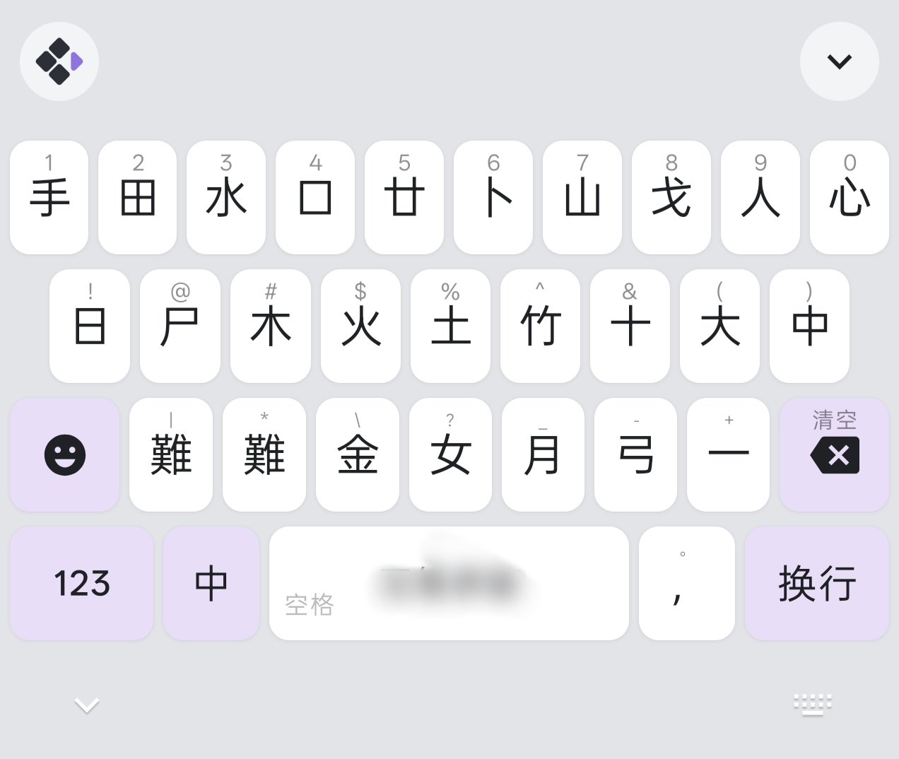

# 全键盘配置教程

> **版本要求**：此功能需要 Xime **v2.4.0 及以上版本**，旧版本不支持自定义配置文件。

Xime 支持通过 `xime.custom.yaml` 配置文件自定义全键盘的按键布局、手势、配色和样式。以下详细介绍各配置字段的含义。

> 配置文件位于设备 `rime/` 目录下，需命名为 `xime.custom.yaml`，修改后需 **重新部署** 生效。
>
> **注意**：请勿直接编辑 `xime.yaml`，应用升级时会被覆盖。自定义配置应始终写在 `xime.custom.yaml` 中，系统会自动合并覆盖默认配置。

---

## 配置文件结构总览

```yaml
customization:        # 版本信息（自动生成，无需手动修改）
  distribution_code_name: Xime
  distribution_version: 0.13.3
  generator: "Xime"
  modified_time: "2026-06-09"
  rime_version: 0.14.3

xime_index:           # 方案/插件/模型市场索引
  base_urls: [...]   # 下载源地址列表

style:                # 全局样式
  color_scheme: lavender_purple

color_schemes:        # 配色方案定义
  lavender_purple:    # 配色名称（与 style.color_scheme 对应）
    name: "薰衣草紫"
    primary_color: 0x8F73E2

keyboard:             # 键盘按键配置
  keys:
    q: { tap: "q", swipe_up: "1", swipe_down: {...}, long_press: {...} }
    # ...
```

---

## `xime_index` — 市场索引

```yaml
xime_index:
  base_urls:
    - "https://cdn.jsdelivr.net/gh/ximeiorg/xime-index/"
    - "https://fastly.jsdelivr.net/gh/ximeiorg/xime-index/"
    - "https://index.ximei.me/"
    - "https://raw.githubusercontent.com/ximeiorg/xime-index/refs/heads/main/"
```

配置方案/插件/模型市场的下载端点。下载器会按顺序依次尝试，直到成功为止。可替换为自建代理或镜像地址。

> 地址末尾需要 `/`。

---

## `style` — 全局样式

```yaml
style:
  color_scheme: lavender_purple  # 使用的配色方案名称（对应 color_schemes 中的键名）
```

### 字段说明

| 字段 | 类型 | 默认值 | 说明 |
|------|------|--------|------|
| `color_scheme` | 字符串 | `"lavender_purple"` | 引用 `color_schemes` 中定义的配色键名 |

---

## `color_schemes` — 配色方案

```yaml
color_schemes:
  lavender_purple:
    name: "薰衣草紫"
    primary_color: 0x8F73E2

  ocean_blue:
    name: "海洋蔚蓝"
    primary_color: 0x1A73E8

  forest_green:
    name: "森林翠绿"
    primary_color: 0x2E7D32

  sunset_orange:
    name: "落日橙光"
    primary_color: 0xE65100

  coral_red:
    name: "珊瑚绯红"
    primary_color: 0xC62828

  slate_gray:
    name: "沉稳石墨"
    primary_color: 0x424242

  rose_pink:
    name: "浪漫玫瑰"
    primary_color: 0xAD1457

  teal_cyan:
    name: "青碧如水"
    primary_color: 0x00796B
```

> 以上为内置配色方案，你也可以自定义添加。

### 字段说明

| 字段 | 类型 | 说明 |
|------|------|------|
| `键名` | 字符串 | 配色唯一标识，如 `lavender_purple`，被 `style.color_scheme` 引用 |
| `name` | 字符串 | 配色显示名称，在设置界面中展示 |
| `primary_color` | 十六进制 | 主题色，格式 `0xAARRGGBB`（Alpha + RGB）。如 `0x8F73E2` 为薰衣草紫 |

> `primary_color` 中的 AA 为 Alpha 通道（透明度），可省略（省略时默认为完全不透明）。

> 更多配色示例可参考内置的示例文件，其中展示了银灰、中灰、烟灰、墨灰等不同灰度的配色方案
```

---

## `keyboard.colors` — 键盘颜色配置

> 可选，不设置则使用内置默认值。

```yaml
keyboard:
  colors:
    keyboard_bg_color: 0xE3E4E8
    keyboard_bg_color_dark: 0x202020
    key_bg_color: 0xFFFFFF
    key_bg_color_dark: 0x4A4A4A
    # special_key_bg_color: 0x9fef86        # 不设置时默认取主题色
    # special_key_bg_color_dark: 0x4A4A4A   # 不设置时默认取主题色
    candidate_bar_bg_color: 0xE3E4E8
    candidate_bar_bg_color_dark: 0x202020
    key_text_color: 0x202124
    key_text_color_dark: 0xE8EAED
    candidate_text_color: 0x202124
    candidate_text_color_dark: 0xE8EAED
```

### 字段说明

| 字段 | 说明 |
|------|------|
| `keyboard_bg_color` | 键盘背景色（亮色模式） |
| `keyboard_bg_color_dark` | 键盘背景色（暗色模式） |
| `key_bg_color` | 按键背景色（亮色模式） |
| `key_bg_color_dark` | 按键背景色（暗色模式） |
| `special_key_bg_color` | 特殊按键背景色（亮色模式，不设置时默认取主题色） |
| `special_key_bg_color_dark` | 特殊按键背景色（暗色模式，不设置时默认取主题色） |
| `candidate_bar_bg_color` | 候选栏背景色（亮色模式） |
| `candidate_bar_bg_color_dark` | 候选栏背景色（暗色模式） |
| `key_text_color` | 按键文字颜色（亮色模式） |
| `key_text_color_dark` | 按键文字颜色（暗色模式） |
| `candidate_text_color` | 候选文字颜色（亮色模式） |
| `candidate_text_color_dark` | 候选文字颜色（暗色模式） |

> 颜色值格式为 `0xAARRGGBB`（Alpha + RGB），AA 可省略（默认为完全不透明）。

---

## `keyboard.shadow` — 按键阴影配置

> 可选，不设置则使用默认值。

```yaml
keyboard:
  shadow:
    enabled: true      # 是否启用阴影
    elevation: 1       # 阴影高度（dp）
    shape_radius: 8    # 阴影圆角半径（dp）
```

### 字段说明

| 字段 | 类型 | 默认值 | 说明 |
|------|------|--------|------|
| `enabled` | 布尔 | `true` | 是否启用按键阴影 |
| `elevation` | 整数 | `1` | 阴影高度，单位 dp |
| `shape_radius` | 整数 | `8` | 阴影圆角半径，单位 dp |


你可以通过上面的配置达到无边框的效果：



---

## `keyboard.keys` — 键盘按键配置

这是全键盘配置的核心部分，每个按键可以定义 4 种手势操作。

### 手势类型

| 手势 | 字段 | 说明 |
|------|------|------|
| 点按 | `tap` | 单击按键 |
| 上滑 | `swipe_up` | 从按键向上滑动 |
| 下滑 | `swipe_down` | 从按键向下滑动 |
| 长按 | `long_press` | 长按按键，弹出气泡后左右滑动选择 |

### 手势值格式

每个手势的值有两种格式：

#### 1. 字符串简写

直接填写字符串，点击后上屏该文本，按键上显示的也是它。

```yaml
q: { tap: "q" }
```

#### 2. 对象格式

```yaml
q: { tap: { label: "Q", action: "commit", value: "q" } }
```

| 字段 | 类型 | 必填 | 说明 |
|------|------|------|------|
| `label` | 字符串 | 是 | 按键上显示的文字 |
| `action` | 字符串 | 是 | 动作类型（见下方动作列表） |
| `value` | 字符串 | 否 | 上屏时的输出文本，不指定则用 `label` |
| `display` | 字符串 | 否 | 显示模式，仅 `swipe_down` 和 `long_press` 支持 |

#### 3. 动作类型（action）

| 动作 | 说明 |
|------|------|
| `commit` | 上屏文字（`value` 指定上屏内容，不指定则用 `label`） |
| `command` | 执行内置命令（`value` 指定命令名） |
| `select_all` | 全选当前输入框中的文本 |
| `copy` | 复制选中的文本 |
| `cut` | 剪切选中的文本 |
| `paste` | 粘贴剪贴板内容 |
| `line_start` | 光标移动到行首 |
| `line_end` | 光标移动到行尾 |
| `undo` | 撤销上一步操作 |
| `none` | 无动作，仅用于显示（如显示五笔字根） |
| `repeat` | 重复上一次输入 |

#### 4. 内置命令（command）

当 `action` 为 `command` 时，`value` 支持以下命令：

| 命令 | 说明 |
|------|------|
| `clear_composition` | 清空当前输入编码和候选词 |

#### 5. 显示模式（display）

仅 `swipe_down` 和 `long_press` 支持：

| 模式 | 值 | 说明 |
|------|------|------|
| 气泡显示 | `"bubble"` | 下滑或长按时以气泡弹出显示内容，不占用按键空间 |
| 按键显示 | `"key"` | 直接在按键上显示文字（最多显示 2 个字符） |

---

### 长按配置（long_press）

长按支持弹出多个选项供用户滑动选择。使用 `display: "bubble"` 配合 `values` 数组：

```yaml
# 对象格式 — 可指定 label、action、value
long_press:
  display: "bubble"
  values:
    - { label: "大写", action: "commit", value: "A" }
    - { label: "Ä",   action: "commit", value: "ä" }

# 字符串简写 — 直接上屏
long_press:
  display: "bubble"
  values: ["q", "Q"]
```

---

### 下滑配置（swipe_down）

下滑通常用于显示五笔字根（`action: none` 仅显示不上屏），或快捷操作（如粘贴、全选等）。

#### 字根显示（气泡模式）

```yaml
swipe_down:
  label: "金 钅𠂊勺㐅 犭𱼀"   # 字根文字
  action: "none"                # 仅显示，不上屏
  display: "bubble"             # 气泡显示
```

#### 快捷操作（按键模式）

```yaml
swipe_down:
  label: "粘贴"      # 按键上显示的文字
  action: "paste"    # 粘贴动作
  display: "key"     # 直接显示在按键上
```

---

## 参考示例

应用内置了以下示例 YAML 文件，可作为自定义配置的参考：

### 完整全键盘配置

```yaml
customization:
  distribution_code_name: Xime
  distribution_version: 0.13.3
  generator: "Xime"
  modified_time: "2026-06-09"
  rime_version: 0.14.3

xime_index:
  # 方案/插件/模型市场索引端点（ximeiorg/xime-index）。
  # 可替换为自建代理/镜像，下载器按顺序依次尝试，直到成功为止。
  # 末尾需要 /。
  base_urls:
    - "https://cdn.jsdelivr.net/gh/ximeiorg/xime-index/"
    - "https://fastly.jsdelivr.net/gh/ximeiorg/xime-index/"
    - "https://index.ximei.me/"
    - "https://raw.githubusercontent.com/ximeiorg/xime-index/refs/heads/main/"

style:
  color_scheme: lavender_purple

color_schemes:
  lavender_purple:
    name: "薰衣草紫"
    primary_color: 0x8F73E2
  
  ocean_blue:
    name: "海洋蔚蓝"
    primary_color: 0x1A73E8
  
  forest_green:
    name: "森林翠绿"
    primary_color: 0x2E7D32
  
  sunset_orange:
    name: "落日橙光"
    primary_color: 0xE65100
  
  coral_red:
    name: "珊瑚绯红"
    primary_color: 0xC62828
  
  slate_gray:
    name: "沉稳石墨"
    primary_color: 0x424242
  
  rose_pink:
    name: "浪漫玫瑰"
    primary_color: 0xAD1457
  
  teal_cyan:
    name: "青碧如水"
    primary_color: 0x00796B

keyboard:
  colors:
    keyboard_bg_color: 0xE3E4E8
    keyboard_bg_color_dark: 0x202020
    key_bg_color: 0xFFFFFF
    key_bg_color_dark: 0x4A4A4A
    candidate_bar_bg_color: 0xE3E4E8
    candidate_bar_bg_color_dark: 0x202020
    key_text_color: 0x202124
    key_text_color_dark: 0xE8EAED
    candidate_text_color: 0x202124
    candidate_text_color_dark: 0xE8EAED
  
  shadow:
    enabled: true
    elevation: 1
    shape_radius: 8
  
  keys:
    # ── 第一行 ──
    # long_press 顺序：小写 → 大写 → 带变音符号的相似字母
    # swipe_down 显示对应的五笔字根（action:none 仅显示不上屏）
    # display: bubble → 气泡显示；key → 显示在按键上（最多显示 2 个字）
    q: { tap: "q", swipe_up: "1", swipe_down: { label: "金 钅𠂊勺㐅 犭𱼀", action: "none", display: "bubble" }, long_press: { display: "bubble", values: ["q", "Q"] } }
    w: { tap: "w", swipe_up: "2", swipe_down: { label: "人亻八癶", action: "none", display: "bubble" }, long_press: { display: "bubble", values: ["w", "W"] } }
    e: { tap: "e", swipe_up: "3", swipe_down: { label: "月⺼彡乃用爫彡𧘇豕", action: "none", display: "bubble" }, long_press: { display: "bubble", values: ["e", "E", "è", "é", "ê", "ë"] } }
    r: { tap: "r", swipe_up: "4", swipe_down: { label: "白手龵扌斤𰀪𠂆", action: "none", display: "bubble" }, long_press: { display: "bubble", values: ["r", "R"] } }
    t: { tap: "t", swipe_up: "5", swipe_down: { label: "禾竹丿𠂉彳夂攵", action: "none", display: "bubble" }, long_press: { display: "bubble", values: ["t", "T"] } }
    y: { tap: "y", swipe_up: "6", swipe_down: { label: "言讠文方广亠丶乀", action: "none", display: "bubble" }, long_press: { display: "bubble", values: ["y", "Y", "ÿ"] } }
    u: { tap: "u", swipe_up: "7", swipe_down: { label: "立六辛冫丬门疒丷䒑", action: "none", display: "bubble" }, long_press: { display: "bubble", values: ["u", "U", "ù", "ú", "û", "ü"] } }
    i: { tap: "i", swipe_up: "8", swipe_down: { label: "水氵小氺头𭕄⺌", action: "none", display: "bubble" }, long_press: { display: "bubble", values: ["i", "I", "ì", "í", "î", "ï"] } }
    o: { tap: "o", swipe_up: "9", swipe_down: { label: "火灬米", action: "none", display: "bubble" }, long_press: { display: "bubble", values: ["o", "O", "ò", "ó", "ô", "õ", "ö", "ø"] } }
    p: { tap: "p", swipe_up: "0", swipe_down: { label: "之辶冖宀廴礻", action: "none", display: "bubble" }, long_press: { display: "bubble", values: ["p", "P"] } }

    # ── 第二行 ──
    a: { tap: "a", swipe_up: "~", swipe_down: { label: "工匚戈艹廿龷七弋戈", action: "none", display: "bubble" }, long_press: { display: "bubble", values: ["a", "A", "à", "á", "â", "ã", "ä", "å", "æ"] } }
    s: { tap: "s", swipe_up: "/", swipe_down: { label: "木丁西", action: "none", display: "bubble" }, long_press: { display: "bubble", values: ["s", "S", "ß"] } }
    d: { tap: "d", swipe_up: "：", swipe_down: { label: "大犬三古龵镸石厂丆", action: "none", display: "bubble" }, long_press: { display: "bubble", values: ["d", "D"] } }
    f: { tap: "f", swipe_up: "；", swipe_down: { label: "土士二干十寸雨", action: "none", display: "bubble" }, long_press: { display: "bubble", values: ["f", "F"] } }
    g: { tap: "g", swipe_up: "“", swipe_down: { label: "王龶五一戋", action: "none", display: "bubble" }, long_press: { display: "bubble", values: ["g", "G"] } }
    h: { tap: "h", swipe_up: "”", swipe_down: { label: "目丨卜⺊上止龰", action: "none", display: "bubble" }, long_press: { display: "bubble", values: ["h", "H"] } }
    j: { tap: "j", swipe_up: "-", swipe_down: { label: "日曰早廾刂虫丿Ⅱ", action: "none", display: "bubble" }, long_press: { display: "bubble", values: ["j", "J"] } }
    k: { tap: "k", swipe_up: "（", swipe_down: { label: "口Ⅲ川", action: "none", display: "bubble" }, long_press: { display: "bubble", values: ["k", "K"] } }
    l: { tap: "l", swipe_up: "）", swipe_down: { label: "田甲囗四罒车皿力", action: "none", display: "bubble" }, long_press: { display: "bubble", values: ["l", "L"] } }

    # ── 第三行 ──
    z: { tap: "z", swipe_up: "*", swipe_down: { label: "", action: "none", display: "key" }, long_press: { display: "bubble", values: [ "z","Z"] } }
    x: { tap: "x", swipe_up: "@", swipe_down: { label: "弓匕纟幺弓𠤎", action: "none", display: "bubble" }, long_press: { display: "bubble", values: ["x", "X"] } }
    c: { tap: "c", swipe_up: "、", swipe_down: { label: "又巴马厶龴ス", action: "none", display: "bubble" }, long_press: { display: "bubble", values: ["c", "C", "ç"] } }
    v: { tap: "v", swipe_up: "？", swipe_down: { label: "女刀九臼巛彐", action: "none", display: "bubble" }, long_press: { display: "bubble", values: ["v", "V"] } }
    b: { tap: "b", swipe_up: "！", swipe_down: { label: "子耳了也阝卩㔾凵", action: "none", display: "bubble" }, long_press: { display: "bubble", values: ["b", "B"] } }
    n: { tap: "n", swipe_up: "%", swipe_down: { label: "已己巳心忄羽乙𠃜", action: "none", display: "bubble" }, long_press: { display: "bubble", values: ["n", "N", "ñ"] } }
    m: { tap: "m", swipe_up: "#", swipe_down: { label: "山由贝冂冎几", action: "none", display: "bubble" }, long_press: { display: "bubble", values: ["m", "M"] } }
```



### 快捷键方案

将第三行按键的下滑手势替换为文本编辑快捷键：

```yaml
style:
  color_scheme: lavender_purple

keyboard:
  colors:
    keyboard_bg_color: 0xE3E4E8
    keyboard_bg_color_dark: 0x202020
    key_bg_color: 0xFFFFFF
    key_bg_color_dark: 0x4A4A4A
    candidate_bar_bg_color: 0xE3E4E8
    candidate_bar_bg_color_dark: 0x202020
    key_text_color: 0x202124
    key_text_color_dark: 0xE8EAED
    candidate_text_color: 0x202124
    candidate_text_color_dark: 0xE8EAED
  
  shadow:
    enabled: true
    elevation: 1
    shape_radius: 8
  
  keys:
    # ── 第三行（仅列出有修改的按键）──
    z: { tap: "z", swipe_up: "*", swipe_down: { label: "全选", action: "select_all", display: "key" }, long_press: { display: "bubble", values: [ { label: "清空", action: "command", value: "clear_composition" } ] } }
    x: { tap: "x", swipe_up: "@", swipe_down: { label: "剪切", action: "cut", display: "key" }, long_press: { display: "bubble", values: ["x", "X"] } }
    c: { tap: "c", swipe_up: "、", swipe_down: { label: "复制", action: "copy", display: "key" }, long_press: { display: "bubble", values: ["c", "C", "ç"] } }
    v: { tap: "v", swipe_up: "？", swipe_down: { label: "粘贴", action: "paste", display: "key" }, long_press: { display: "bubble", values: ["v", "V"] } }
    b: { tap: "b", swipe_up: "！", swipe_down: { label: "", action: "none", display: "key" }, long_press: { display: "bubble", values: ["b", "B"] } }
    n: { tap: "n", swipe_up: "%", swipe_down: { label: "段首", action: "line_start", display: "key" }, long_press: { display: "bubble", values: ["n", "N", "ñ"] } }
    m: { tap: "m", swipe_up: "#", swipe_down: { label: "段尾", action: "line_end", display: "key" }, long_press: { display: "bubble", values: ["m", "M"] } }
```


### 配色主题示例

展示了不同灰度的配色方案（银灰 · 浅、中灰 · 中、烟灰 · 深、墨灰 · 浓），可供参考自定义 `color_schemes`：

```yaml
style:
  color_scheme: zine_medium

color_schemes:
  zine_light:
    name: "银灰 · 浅"
    primary_color: 0x9E9E9E
  
  zine_medium:
    name: "中灰 · 中"
    primary_color: 0x616161
  
  zine_dark:
    name: "烟灰 · 深"
    primary_color: 0x424242
  
  zine_deep:
    name: "墨灰 · 浓"
    primary_color: 0x212121
```



### 仓颉输入法的显示

```yaml
keyboard:
  keys:
    # ── 第一行 ──
    # long_press 顺序：小写 → 大写 → 带变音符号的相似字母
    # tap 显示对应的仓颉字根
    q: { tap: { label: "手", action: "commit", value: "q" }, swipe_up: "1", long_press: { display: "bubble", values: ["q", "Q"] } }
    w: { tap: { label: "田", action: "commit", value: "w" }, swipe_up: "2", long_press: { display: "bubble", values: ["w", "W"] } }
    e: { tap: { label: "水", action: "commit", value: "e" }, swipe_up: "3", long_press: { display: "bubble", values: ["e", "E", "è", "é", "ê", "ë"] } }
    r: { tap: { label: "口", action: "commit", value: "r" }, swipe_up: "4", long_press: { display: "bubble", values: ["r", "R"] } }
    t: { tap: { label: "廿", action: "commit", value: "t" }, swipe_up: "5", long_press: { display: "bubble", values: ["t", "T"] } }
    y: { tap: { label: "重", action: "commit", value: "y" }, swipe_up: "6", long_press: { display: "bubble", values: ["y", "Y", "ÿ"] } }
    u: { tap: { label: "山", action: "commit", value: "u" }, swipe_up: "7", long_press: { display: "bubble", values: ["u", "U", "ù", "ú", "û", "ü"] } }
    i: { tap: { label: "戈", action: "commit", value: "i" }, swipe_up: "8", long_press: { display: "bubble", values: ["i", "I", "ì", "í", "î", "ï"] } }
    o: { tap: { label: "人", action: "commit", value: "o" }, swipe_up: "9", long_press: { display: "bubble", values: ["o", "O", "ò", "ó", "ô", "õ", "ö", "ø"] } }
    p: { tap: { label: "心", action: "commit", value: "p" }, swipe_up: "0", long_press: { display: "bubble", values: ["p", "P"] } }

    # ── 第二行 ──
    a: { tap: { label: "日", action: "commit", value: "a" }, swipe_up: "~", long_press: { display: "bubble", values: ["a", "A", "à", "á", "â", "ã", "ä", "å", "æ"] } }
    s: { tap: { label: "尸", action: "commit", value: "s" }, swipe_up: "/", long_press: { display: "bubble", values: ["s", "S", "ß"] } }
    d: { tap: { label: "木", action: "commit", value: "d" }, swipe_up: "：", long_press: { display: "bubble", values: ["d", "D"] } }
    f: { tap: { label: "火", action: "commit", value: "f" }, swipe_up: "；", long_press: { display: "bubble", values: ["f", "F"] } }
    g: { tap: { label: "土", action: "commit", value: "g" }, swipe_up: "“", long_press: { display: "bubble", values: ["g", "G"] } }
    h: { tap: { label: "竹", action: "commit", value: "h" }, swipe_up: "”", long_press: { display: "bubble", values: ["h", "H"] } }
    j: { tap: { label: "十", action: "commit", value: "j" }, swipe_up: "-", long_press: { display: "bubble", values: ["j", "J"] } }
    k: { tap: { label: "大", action: "commit", value: "k" }, swipe_up: "（", long_press: { display: "bubble", values: ["k", "K"] } }
    l: { tap: { label: "中", action: "commit", value: "l" }, swipe_up: "）", long_press: { display: "bubble", values: ["l", "L"] } }

    # ── 第三行 ──
    z: { tap: { label: "難", action: "commit", value: "z" }, swipe_up: "*", long_press: { display: "bubble", values: [ "z","Z"] } }
    x: { tap: { label: "卜", action: "commit", value: "x" }, swipe_up: "@", long_press: { display: "bubble", values: ["x", "X"] } }
    c: { tap: { label: "金", action: "commit", value: "c" }, swipe_up: "、", long_press: { display: "bubble", values: ["c", "C", "ç"] } }
    v: { tap: { label: "女", action: "commit", value: "v" }, swipe_up: "？", long_press: { display: "bubble", values: ["v", "V"] } }
    b: { tap: { label: "月", action: "commit", value: "b" }, swipe_up: "！", long_press: { display: "bubble", values: ["b", "B"] } }
    n: { tap: { label: "弓", action: "commit", value: "n" }, swipe_up: ".", long_press: { display: "bubble", values: ["n", "N", "ñ"] } }
    m: { tap: { label: "一", action: "commit", value: "m" }, swipe_up: "#", long_press: { display: "bubble", values: ["m", "M"] } }
```




